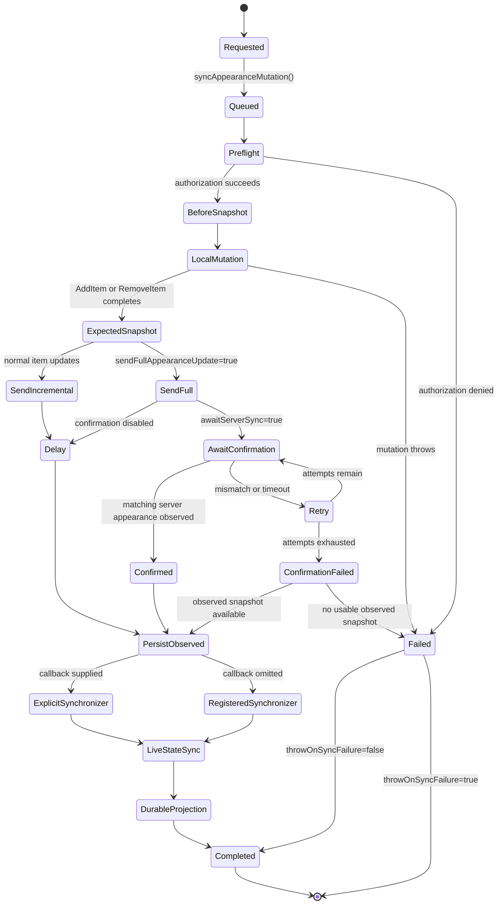
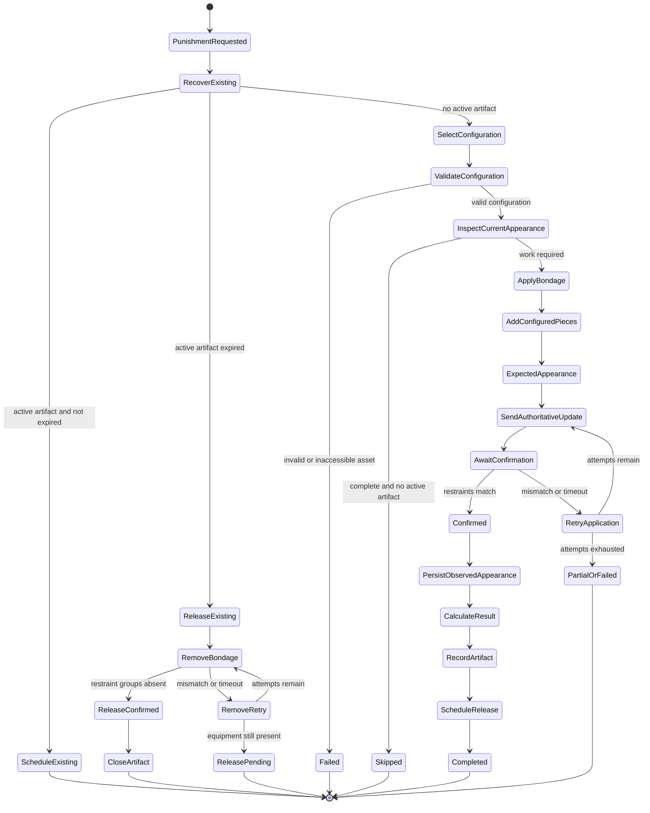

# Veratown Appearance Mutation Flow

This document describes the interfaces and complete lifecycle for adding and
removing bondage equipment in Veratown. It also documents the Bunny punishment
system, including its durable artifact and release workflow.

## Core Interfaces

### `AppearanceMutationContext`

Defined in `shared/appearanceLifecycle.ts`, this context identifies and
describes one appearance operation:

- `operationId`: stable correlation identifier for the operation
- `timestamp`: operation creation time
- `source`: subsystem that initiated the mutation, such as `bunny`, `cage`, or
  `release`
- `reason`: human-readable operation reason
- `releaseCause`: optional cause such as `safeword`, `timer`, or `admin`
- `expectedAppearance`: locally expected post-mutation appearance
- `observedAppearance`: authoritative appearance received from the server
- `verificationStatus`: confirmation result such as `confirmed`, `mismatch`,
  `timeout`, or `observed`

The context is the audit and correlation record that travels from the mutation
boundary into persistence.

### `AppearanceStateSynchronizer`

Defined in `shared/appearanceSync.ts`:

```typescript
type AppearanceStateSynchronizer = (
    character: API_Character,
    context?: AppearanceMutationContext,
    observedAppearance?: readonly BC_AppearanceItem[],
) => Promise<void>;
```

The third argument is important. It is the authoritative server snapshot when
one was received. Callers must pass it through rather than rebuilding the
appearance from the local API character.

### `syncAppearanceMutation`

This is the shared mutation boundary used by the Veratown bondage systems. It:

1. Serializes appearance mutations for the same character.
2. Runs authorization and wardrobe-access preflight checks.
3. Captures the appearance before the mutation.
4. Executes the local `AddItem` or `RemoveItem` operation.
5. Captures the locally expected appearance.
6. Sends incremental or full appearance updates as configured.
7. Waits for authoritative server confirmation when requested.
8. Retries confirmation when the server reports a mismatch or times out.
9. Calls the explicit synchronizer or the registered synchronizer with the
   mutation context and observed snapshot.
10. Preserves the observed snapshot for persistence even when confirmation
    ultimately fails after a usable server observation.

### `LiveCharacterStateSync.syncCharacter`

`LiveCharacterStateSync` is the persistence adapter. Its effective input is:

```typescript
syncCharacter(
    character,
    position,
    forcePositionPersistence,
    mutationContext,
    observedAppearance,
);
```

When `observedAppearance` is available, it is validated and used as the
appearance projection. Without it, the adapter falls back to the local
`MakeAppearanceBundle()` result. It then persists:

- the current appearance
- derived restraint state
- expected and observed appearance metadata
- operation identity and verification status
- appearance mutation audit information when supported

## General Bondage Add and Remove Flow

The same flow is used by Cage, Kennel, Shower, Bed, Furniture Bondage,
Veratown Release, and Bunny. The operation-specific code supplies the mutation
and the server verification predicate; the synchronization and persistence
contract remains shared.



### Add operation

An add operation typically looks like this conceptually:

```typescript
await syncAppearanceMutation(
    character,
    () => {
        character.Appearance.AddItem(asset);
    },
    delayMs,
    stateSynchronizer,
    {
        source: "veratown",
        reason: "bondage_applied",
        sendFullAppearanceUpdate: true,
        awaitServerSync: true,
    },
);
```

The server predicate normally verifies that the required item or group exists
with the expected applied properties.

### Remove operation

A remove operation uses the same boundary:

```typescript
await syncAppearanceMutation(
    character,
    () => {
        character.Appearance.RemoveItem(group);
    },
    delayMs,
    stateSynchronizer,
    {
        source: "release",
        reason: "bondage_removed",
        releaseCause: "timer",
        cleanupAllowed: true,
        sendFullAppearanceUpdate: true,
        awaitServerSync: true,
    },
);
```

The removal predicate normally verifies that the target group or item is no
longer present. Persistence occurs only through the observed synchronized
projection when that projection is available.

## Bunny Punishment State Machine

The Bunny system adds configured restraint pieces, records a durable artifact,
schedules a release, and later removes exactly the artifact-owned groups.



### Bunny application flow

1. Recover any existing Bunny artifact before applying a new punishment.
2. Select and validate the configured restraint pieces.
3. Inspect the current appearance.
4. Skip when all required pieces already exist and no active artifact is
   present.
5. Add each permitted restraint piece and apply its color, craft metadata,
   extended type, and consent padlock configuration.
6. Send a full appearance update and wait for authoritative confirmation.
7. Require every configured restraint in the server predicate.
8. Forward `observedAppearance` to the Bunny state synchronizer.
9. Persist the authoritative projection and derive the actually applied pieces
   from it.
10. Record the durable Bunny artifact and schedule its release timer.

The result calculation prefers the authoritative snapshot and only falls back
to the local appearance bundle when no observed snapshot exists.

### Bunny release flow

1. Confirm the artifact still belongs to the current operation and version.
2. Remove each artifact restraint group.
3. Send a full appearance update and wait for authoritative confirmation.
4. Require every artifact restraint group to be absent.
5. Forward the observed removal snapshot to `LiveCharacterStateSync`.
6. Retry when confirmation mismatches or times out.
7. Close the durable artifact only after removal is verified.

This prevents a stale local appearance from restoring removed Bunny equipment in
the durable Veratown projection.

## Covered Systems and Boundary

The shared observed-snapshot handoff covers the Veratown systems that use
`syncAppearanceMutation` with live state persistence:

- Bunny add and release
- Cage
- Kennel
- Shower
- Bed
- Furniture Bondage
- Veratown ReleaseSystem

Some Casino and Dare paths still perform direct `AddItem` or `RemoveItem`
operations outside this shared boundary. Those paths do not automatically get
the same serialized authoritative-confirmation guarantees until they are
converted to `syncAppearanceMutation` or given an equivalent adapter.

## Source Files

- `shared/appearanceLifecycle.ts` - mutation context and appearance metadata
- `shared/appearanceSync.ts` - mutation boundary and confirmation handling
- `shared/index.ts` - shared exports
- `liveCharacterStateSync.ts` - live-to-durable projection
- `bunnyPunishmentService.ts` - Bunny application and release lifecycle
- `cageSystem.ts`, `kennelSystem.ts`, `showerSystem.ts` - confinement and
  appearance operations
- `bedSystem.ts`, `furnitureBondageSystem.ts` - bondage equipment operations
- `veratownReleaseSystem.ts` - general release integration
