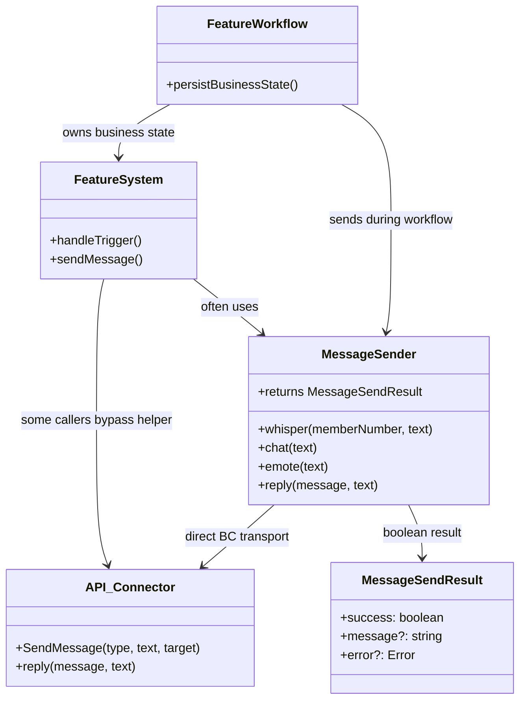
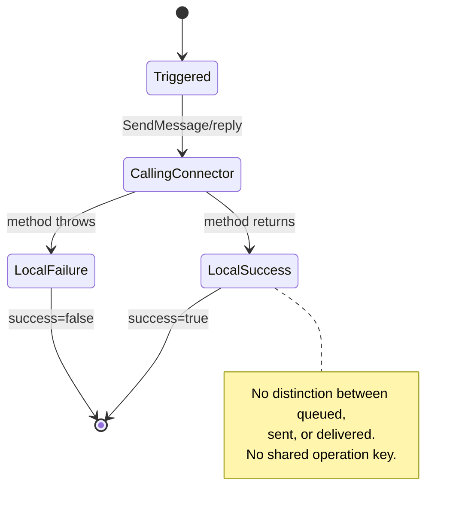
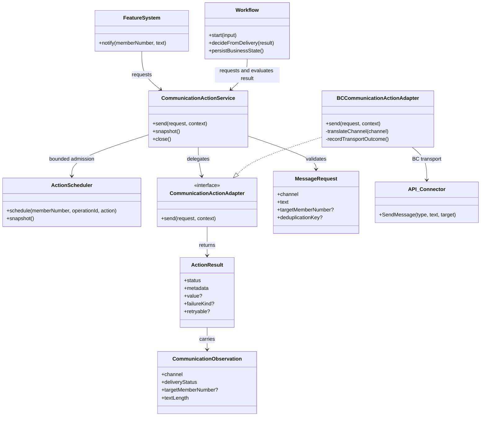
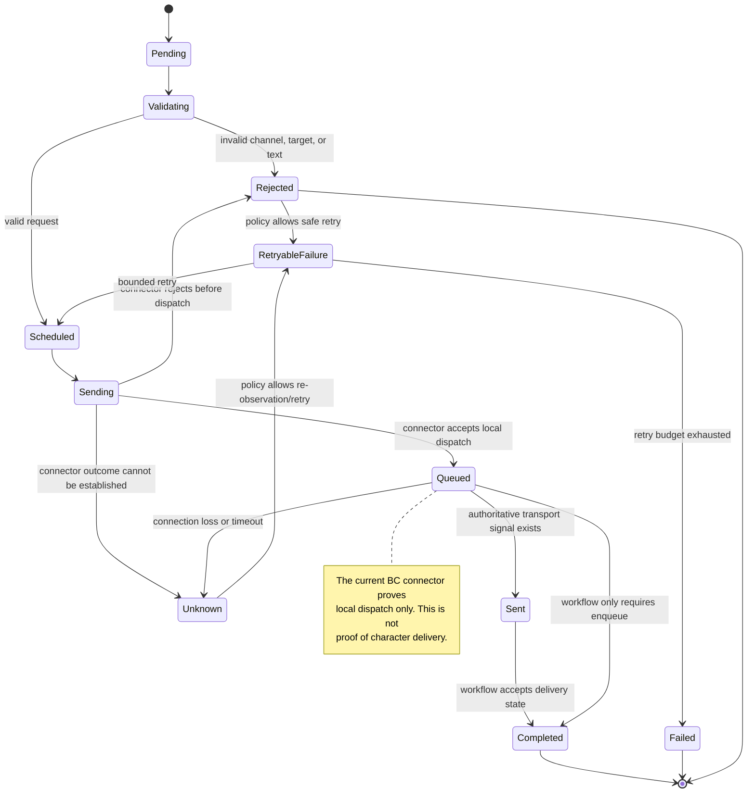

# Communication Actions

This document defines the communication action family described by the
headless action layer. It records the current **IST** architecture, the target
**SOLL** architecture, delivery-state ownership, and the incremental migration
boundary.

Communication is an external action, not durable game state. The action layer
may report that a message was accepted by the local connector, but a workflow
must not claim that a character received or acted on the message unless a
separate authoritative delivery signal exists.

## Scope

The first communication slice covers:

- targeted whispers;
- public chat messages;
- public emotes;
- targeted emotes;
- normalized message requests;
- operation-keyed in-flight and short-lived duplicate suppression;
- structured queued, sent, rejected, and unknown outcomes;
- BC connector translation and transport diagnostics.

Replies to a specific inbound chat message, delivery receipts, notification
policies, and durable narrative workflows remain explicit follow-up contracts.
They must not be inferred from a successful `SendMessage` call.

## Finalized Iteration 5 Boundary

The current communication domain claims the targeted notification slice in the
Veratown feature systems. The migrated callers are LocationMonitor, Window,
Kennel, Cage, BunnyPark, KeypadDoor, Shower, FurnitureBondage, CatDog, and
Trashcan. Each caller retains a legacy fallback and uses the disabled-by-default
`communication-notifications` rollout lease.

The transport contract is deliberately conservative:

- `queued` means `SendMessage` returned without throwing. It is local dispatch,
  not proof that Bondage Club delivered or displayed the message.
- `unknown` means the connector threw or the outcome could not be established.
  It is retryable only under an explicit caller policy.
- `sent` is reserved for a future authoritative connector receipt.
- `rejected` is reserved for a future connector result that proves no dispatch
  occurred.
- `reply(message, text)` remains outside this contract until inbound-message
  correlation, reply failure semantics, and retry ownership are specified.

### Caller inventory

| Caller                 | Migrated operation                              | Channel | Remaining boundary                                      |
| ---------------------- | ----------------------------------------------- | ------- | ------------------------------------------------------- |
| LocationMonitor        | Help/monitor response                           | whisper | Real connector qualification                            |
| WindowSystem           | Peep notification                               | emote   | Real connector qualification and rollback record        |
| KennelSystem           | Unavailable-containment whisper                 | whisper | Real connector qualification                            |
| CageSystem             | Unavailable and short entry/release status      | whisper | Long warning and recovery remain legacy-owned           |
| BunnyParkSystem        | Park-entry, pre-punishment, and failure notices | whisper | Punishment workflow remains separate                    |
| KeypadDoorSystem       | Throttled notification helper                   | whisper | Door workflow remains legacy-owned                      |
| ShowerSystem           | Player-facing status/error notices              | whisper | NarratorBot emotes remain workflow output               |
| FurnitureBondageSystem | Player-facing notices                           | whisper | Public narration and admin messages remain legacy-owned |
| CatDogSystem           | Vibrator-triggered notice                       | whisper | Pet emotes, movement, and bondage remain legacy-owned   |
| TrashcanSystem         | Found-item notification                         | emote   | Message-event trigger remains feature-owned             |

Direct command replies, casino/hub/adventure narration, and transport calls
outside this inventory are explicitly excluded from this iteration. They are
not evidence that the targeted notification slice is incomplete; they require
their own reply or public-narration contracts.

## IST: Current Communication Architecture

Today, feature systems use a mixture of the shared `MessageSender`, direct
connector calls, and direct `reply` calls. `MessageSender` centralizes some
transport calls, but its `success: true` result means only that the synchronous
connector method did not throw. It does not identify an operation, suppress a
duplicate, or distinguish local queueing from server delivery.

### IST ownership

| Concern           | Current owner                               | Current behavior                                                                        | Risk                                                                               |
| ----------------- | ------------------------------------------- | --------------------------------------------------------------------------------------- | ---------------------------------------------------------------------------------- |
| Message intent    | Feature system                              | Text and channel are selected inline                                                    | Business and transport concerns are mixed                                          |
| Target validation | Individual caller or BC connector           | Often implicit                                                                          | Invalid or missing targets fail late                                               |
| Dispatch          | `MessageSender` or `API_Connector`          | Synchronous `SendMessage`/`reply` call                                                  | Direct BC dependency spreads through feature code                                  |
| Delivery result   | `MessageSendResult`                         | Boolean success or thrown error                                                         | Queued is mistaken for delivered                                                   |
| Duplicate control | Individual feature                          | Usually absent                                                                          | Retries and repeated triggers can spam characters                                  |
| Retry policy      | Individual feature                          | Inconsistent                                                                            | Unsafe replay or hot retry loops are possible                                      |
| Durable state     | Feature workflow/store                      | Separate from message dispatch                                                          | No shared correlation between action and workflow                                  |
| Lifecycle         | Communication service and room orchestrator | Service closes its scheduler and process-local deduplication state during room shutdown | In-flight transport and connector lifecycle still require controlled-room evidence |

### IST UML

### IST state management

The current state is ephemeral and local to the caller. There is no shared
communication state machine, no action scheduler admission, and no durable
message delivery record.

## SOLL: Layered Communication Architecture

The target separates message intent, action admission, BC translation, and
workflow state:

1. A feature or workflow creates a normalized `MessageRequest` and
   `ActionContext`.
2. `CommunicationActionService` validates the request, schedules it through
   the bounded action scheduler, and suppresses duplicate operation keys.
3. `CommunicationActionAdapter` performs one bounded external operation.
4. `BCCommunicationActionAdapter` translates the domain request to the
   connector API and records the strongest delivery state the connector can
   prove.
5. The adapter returns an `ActionResult<CommunicationObservation>`.
6. The workflow decides whether `queued`, `sent`, `rejected`, or `unknown` is
   sufficient for its business transition. Actions never write game state.

### SOLL ownership

| Concern                      | SOLL owner                          | Contract                                                    |
| ---------------------------- | ----------------------------------- | ----------------------------------------------------------- |
| Message intent               | Feature/workflow                    | `MessageRequest` plus source, reason, and operation ID      |
| Validation and normalization | `CommunicationActionService`        | Non-empty text, valid channel/target, bounded length        |
| Per-character isolation      | `ActionScheduler`                   | Bounded queue and duplicate in-flight operation handling    |
| Duplicate suppression        | Communication service               | Stable operation/deduplication key with bounded retention   |
| BC translation               | `BCCommunicationActionAdapter`      | `MessageChannel` to `TellType` mapping                      |
| Transport result             | Adapter                             | `queued`, `sent`, `rejected`, or `unknown`                  |
| Business retry               | Workflow                            | Bounded retry with explicit policy and no blind replay      |
| Durable consequences         | Existing mutation services/workflow | Only after the workflow decides the result is sufficient    |
| Observability                | Service and adapter                 | Operation ID, action ID, channel, target, duration, outcome |

### SOLL UML

### SOLL state management overview

Communication state has three scopes. Keeping them separate prevents a
transport acknowledgement from becoming an accidental game-state mutation.

| State scope     | Example state                                                | Owner                               | Lifetime                                 |
| --------------- | ------------------------------------------------------------ | ----------------------------------- | ---------------------------------------- |
| Request state   | channel, normalized text, target, operation ID               | Feature/workflow and action context | One action attempt                       |
| Transport state | queued, sent, rejected, unknown, attempt, duration           | Communication service/adapter       | In memory; observable in logs and result |
| Business state  | notification acknowledged, workflow stage, audit consequence | Workflow and mutation services      | Durable when the workflow requires it    |

The current BC adapter returns `queued` after `SendMessage` returns without
throwing. When the connector call throws, the adapter returns `unknown` with a
transient, retryable failure because it cannot prove whether the underlying
transport dispatched the message. `rejected` remains available for a future
connector contract that proves no dispatch occurred. `sent` is reserved for a
future connector delivery signal or an explicitly documented transport
guarantee.

The service's deduplication cache is bounded and process-local. A stable
operation ID or deduplication key can be reused after a retry or reconnect, but
the action layer does not claim duplicate suppression across process restart;
a durable workflow must own that obligation when restart protection is
required.

### Reply and replay decisions for the targeted notification slice

The targeted notification callers do not advance durable workflow state from a
message result. Their process-local deduplication window is therefore
intentional: reconnect retries are bounded by the caller, while a process
restart may repeat a non-authoritative notification rather than silently
claiming durable delivery. No caller in the current inventory requires a
durable communication journal for its migrated notification.

Command replies remain outside the migrated notification slice. Before any
reply caller is migrated, it must register a request ID with the expected
sender and a bounded timeout. An inbound response must carry a response ID and
be classified as exactly one of `matched`, `sender_mismatch`, `duplicate`,
`late`, or `unknown_request`. A sender mismatch does not complete the request;
an expired or restarted request fails closed as `late` or `unknown_request`.
The transport-neutral contract and simulated restart/late-response coverage
are implemented in `bin/action-layer/reply-correlation.ts` and its focused
tests. This is correlation evidence, not an authoritative delivery receipt.

As of 2026-10-01, the local action-layer one-cycle gate, communication-family
tests, and 22-test real-room harness contract are green. A safe live
`release-observe` run completed separately with run ID
`d0f31da9-eee1-4787-8c86-9011bbd89174`; no communication canary or rollout
switch was enabled from that observation.

## Incremental Implementation Plan

Each iteration must leave the legacy path working and produce executable
evidence.

### Iteration 1: Design and domain contract

- [x] Add `CommunicationDeliveryStatus` and `CommunicationObservation`.
- [x] Define validation rules for channel, target, normalized text, and length.
- [x] Add domain tests for valid and invalid requests.
- [x] Register the design in the action-layer overview.

### Iteration 2: Service and transport adapter

- [x] Implement `CommunicationActionService` using the existing scheduler.
- [x] Implement `BCCommunicationActionAdapter` as the only `bc-bot` import in the
      new communication slice.
- [x] Preserve `MessageSender` as a compatibility facade for existing callers.
- [x] Add contract tests for channel mapping, queued results, exceptions, and
      operation-keyed duplicate suppression.

### Iteration 3: DI and observability

- [x] Register one communication service per connector/container lifecycle.
- [x] Expose queue and recent-deduplication diagnostics.
- [x] Include operation ID, action ID, member number, channel, target, outcome,
      and attempt in structured logs.
- [x] Provide a close path that shuts down the action scheduler and clears
      process-local deduplication state.
- [x] Close the room-scoped communication service at the start of
      `Veratown.shutdown()` so later room cleanup cannot leave communication
      admission active.
- [x] Expose the communication rollout operation through validated file and
      environment configuration with a disabled default.

### Iteration 4: First low-risk caller

- [x] Route location-monitor notifications through the service.
- [x] Compare legacy and action results without changing business transitions.
- [x] Keep the action path disabled by default and explicitly inject it in
      controlled tests until connector behavior is qualified.

### Iteration 5: Broader migration

- [ ] Qualify whisper, chat, emote, disconnect, reconnect, and thrown-connector
      outcomes against a real connector. `queued` is still local dispatch, not
      delivery.
- [x] Migrate the WindowSystem public peep notification as an additional
      low-risk caller with an explicit operation key, rollout lease, legacy
      fallback, and focused integration coverage.
- [x] Retain local action/legacy comparison evidence and an in-flight caller
      rollback record for the WindowSystem notification.
- [x] Migrate the KennelSystem unavailable-containment whisper as a low-risk
      targeted caller with an explicit operation key, rollout lease, legacy
      fallback, and focused coverage.
- [x] Migrate the CageSystem unavailable-containment whispers as a low-risk
      targeted caller with a shared helper, explicit operation key, rollout
      lease, legacy fallback, and focused coverage.
- [x] Migrate the BunnyParkSystem park-entry, pre-punishment, and
      punishment-failure notifications as low-risk targeted callers with
      explicit operation keys, rollout leases, legacy fallbacks, and focused
      coverage; retain punishment execution as workflow-owned behavior.
- [x] Migrate the KeypadDoorSystem notification helper as a low-risk targeted
      caller with throttling, unique operation keys, rollout leases, legacy
      fallback, and focused coverage.
- [x] Migrate ShowerSystem player-facing status/error whispers through a shared
      helper with unique operation keys, rollout leases, legacy fallback, and
      focused coverage; retain NarratorBot emotes as public workflow output.
- [x] Migrate CageSystem short entry/release status whispers through its shared
      helper with stable operation keys, rollout leases, legacy fallback, and
      focused coverage; retain the long entrance warning as legacy-owned until
      message chunking or a contract revision exists.
- [x] Migrate FurnitureBondageSystem player-facing whispers through a shared
      helper with stable operation keys, rollout leases, legacy fallback, and
      focused coverage; retain public narration and admin messages outside this
      notification slice.
- [x] Migrate CatDogSystem vibrator-triggered player whispers through a shared
      helper with stable operation keys, rollout leases, legacy fallback, and
      focused coverage; retain public pet emotes, bot movement, and bondage
      mutation outside this notification slice.
- [x] Migrate TrashcanSystem found-item emotes through the shared action path
      with a stable operation key, rollout lease, legacy fallback, focused
      coverage, and a regression test for generic Message event registration.
- [x] Implement the opt-in real-room test-bot harness described in
      [REAL_ROOM_TEST_BOT_PROPOSAL.md](REAL_ROOM_TEST_BOT_PROPOSAL.md), including
      configuration validation, safe-command rejection, dry-run mode, bounded
      response waits, and cleanup tests.
- [ ] Qualify the WindowSystem caller against a real connector and retain the
      corresponding action/legacy comparison evidence.
- [ ] Define reply correlation and authoritative delivery semantics before
      migrating replies or workflow-critical notifications.
- [ ] Add durable replay protection where a notification is part of a
      recoverable workflow.
- [ ] Retire direct `SendMessage` calls only after caller ownership, rollback,
      and delivery semantics are documented.

### Current gate

The first communication slice is locally qualified by:

- `bin/action-layer/__tests__/communication-service.test.ts`;
- `bin/action-layer/__tests__/bc-communication.test.ts`;
- `bin/action-layer/__tests__/rollout.test.ts`; and
- `bin/games/veratown/__tests__/locationMonitorSystem.test.ts`, including the
  enabled rollout path; and
- `bin/games/veratown/__tests__/windowSystem.test.ts`, including action and
  legacy paths; and
- `bin/games/veratown/__tests__/windowSystemRollback.test.ts`, including the
  in-flight rollback path; and
- `bin/games/veratown/__tests__/kennelSystem.test.ts`, including action and
  legacy unavailable-containment paths.
- `bin/games/veratown/__tests__/cageSystem.test.ts`, including action and
  legacy unavailable-containment paths.
- `bin/games/veratown/__tests__/bunnyParkSystem.test.ts`, including the
  enabled park-entry, pre-punishment, and punishment-failure notification
  paths and existing punishment coverage; and
- `bin/games/__tests__/unit/keypadDoorSystemRefactored.test.ts`, including
  enabled action and legacy notification paths; and
- `bin/games/veratown/__tests__/showerSystem.test.ts`, including enabled action
  and legacy notification paths; and
- `bin/games/veratown/__tests__/cageSystem.test.ts`, including the enabled
  unavailable-containment and short-entry action paths and the repaired
  `recoverCagedCharacter` recovery entry point; and
- `bin/games/veratown/__tests__/furnitureBondageSystem.test.ts`, including
  enabled action and legacy notification paths; and
- `bin/games/veratown/__tests__/catDogSystem.test.ts`, including enabled action
  and legacy vibrator notification paths; and
- `bin/games/veratown/__tests__/trashcanSystem.test.ts`, including enabled
  action and legacy found-item notification paths through the registered
  generic Message event handler; and
- `pnpm test:communication`, which runs the complete local communication slice
  with concurrency one.
- `pnpm test:qualification:real-room`, which runs the local real-room harness
  contract without opening a connector. Its 16 local tests cover transport,
  connector fault, disconnect, reconnect, room identity, cleanup, and redacted
  evidence persistence.

The next phase requires those tests plus a controlled-room connector record for
queued and unknown outcomes, reconnect behavior, and one caller rollback. The
local disconnect/reconnect and rollback tests cover the simulated connector
and caller contracts; the communication switch remains disabled until the
controlled-room evidence is accepted.

The current promotion decision is therefore: local targeted-notification
implementation is complete, but production enablement is blocked until the
controlled-room record, rollback evidence, and an explicit decision on durable
replay protection are accepted. Reply migration is a separate phase.

The next implementation slice is Phase 1 protocol smoke qualification. Run the
implemented harness in a dedicated existing room with `ChatRoomJoin` only,
using a dedicated account and an approved read-only command. Once that record
passes, use the harness for the WindowSystem connector record and one
action/legacy rollback comparison. Do not migrate another notification caller
until that evidence exists.

## Controlled-room Playwright qualification

VS Code's Playwright browser tooling can exercise the real Bondage Club room
without adding browser automation to the bot runtime. The qualification should
be opt-in and use a locally configured room URL plus an already-authenticated
browser profile; credentials and session tokens must not be passed through the
assistant or committed to the repository.

The complete proposal, including the connector-first harness and its safety
rules, is maintained in
[REAL_ROOM_TEST_BOT_PROPOSAL.md](REAL_ROOM_TEST_BOT_PROPOSAL.md).

The first controlled run should be non-destructive and cover whisper, chat,
emote, duplicate operation keys, connector disconnect/reconnect, one migrated
caller, and one disabled-rollout legacy fallback. Retain the room URL label,
operation key, observed UI/room result, connector observation, and rollback
result. A visible message is useful evidence but still does not promote
`queued` to `sent` without an authoritative receipt.

No real-room result is claimed until a reachable test room, safe test
characters, an authenticated browser session, and an approved observation
window are available.

## Acceptance Criteria

Communication implementation is complete for the first action slice when:

- domain validation and normalization are covered by unit tests;
- each supported channel maps correctly to the BC connector;
- queueing is not reported as delivery;
- connector exceptions produce structured, non-success outcomes;
- repeated operation keys do not send duplicate messages within the bounded
  deduplication window;
- per-character queues remain isolated and bounded;
- the service is DI-registered and closes cleanly;
- existing `MessageSender` callers remain behavior-compatible;
- focused tests, strict TypeScript, formatting, and the import boundary pass;
- at least one low-risk caller has a controlled adapter integration test.

The first action slice meets these criteria through the communication service,
BC adapter, Veratown DI registration, and opt-in `LocationMonitorSystem` and
`WindowSystem` integrations. This does not constitute full communication-family
migration.

Full communication-family migration additionally requires real connector
qualification, failure-injection evidence, caller-by-caller rollback, and
removal or quarantine of direct transport calls.
