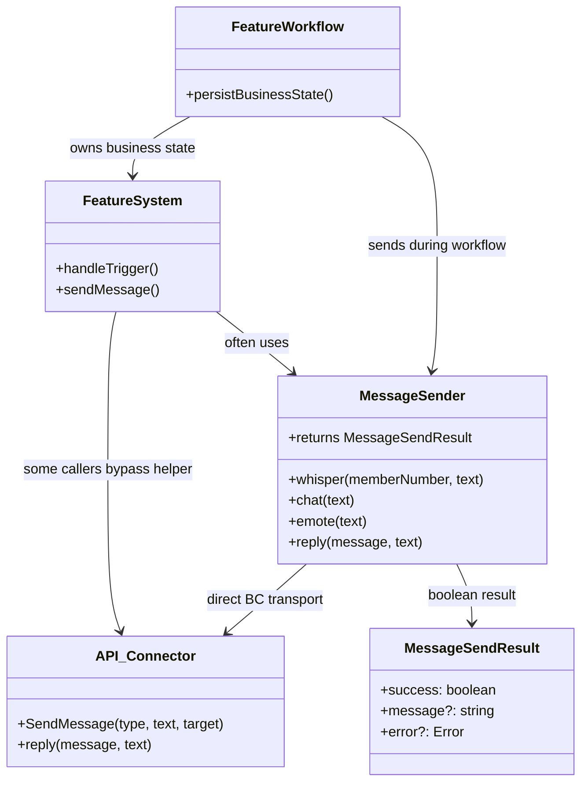
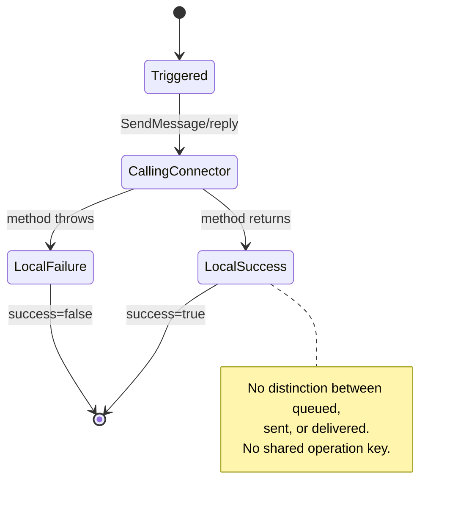
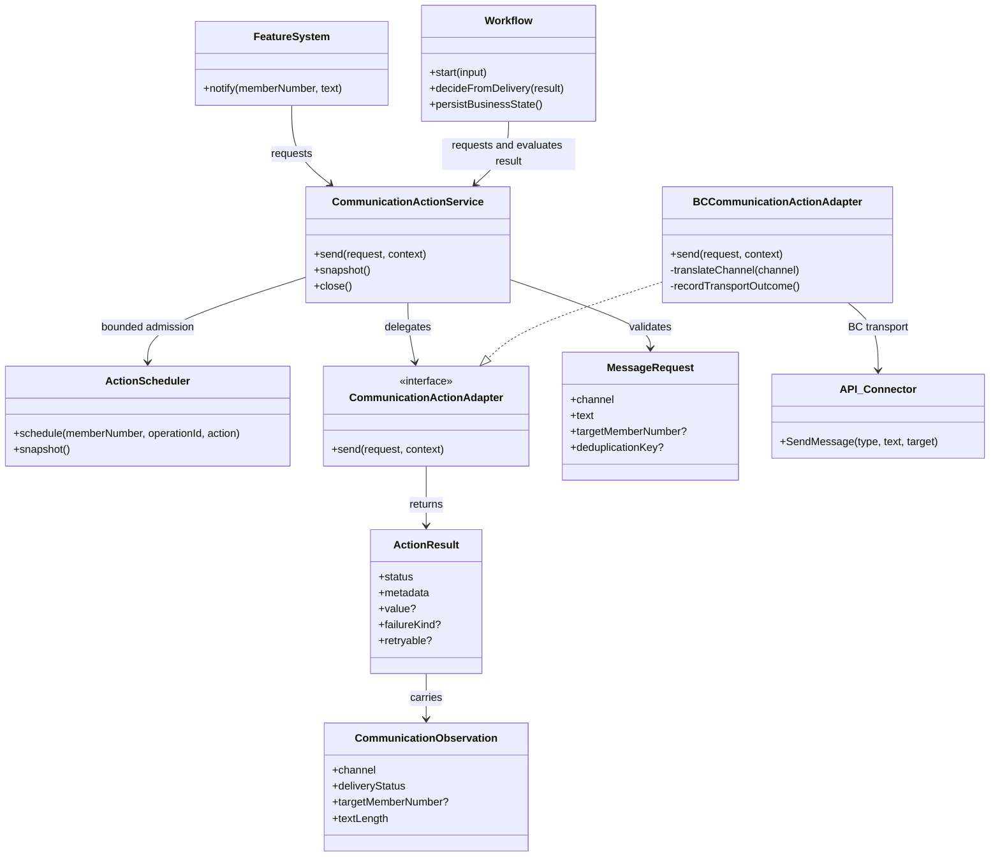
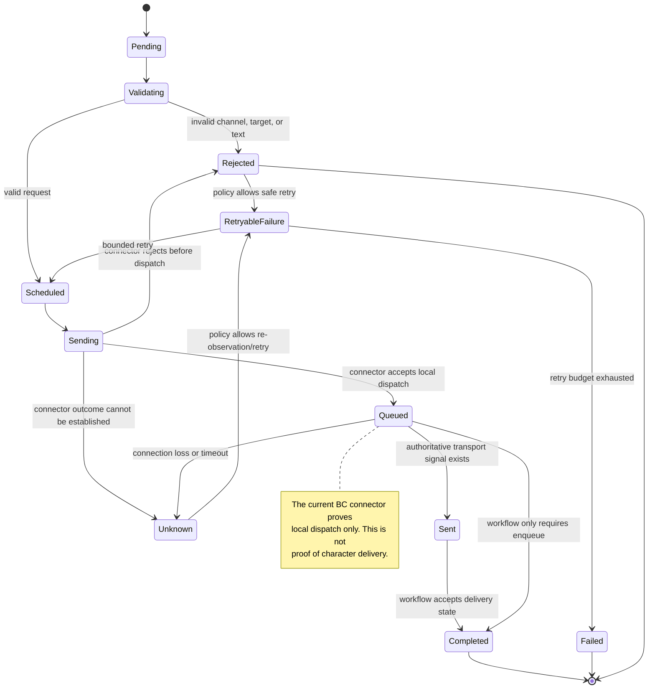

# Communication Actions

This document defines the communication action family described by the
headless action layer. It records the current **IST** architecture, the target
**SOLL** architecture, delivery-state ownership, and the incremental migration
boundary.

Communication is an external action, not durable game state. The action layer
may report that a message was accepted by the local connector, but a workflow
must not claim that a character received or acted on the message unless a
separate authoritative delivery signal exists.

## Scope

The first communication slice covers:

- targeted whispers;
- public chat messages;
- public emotes;
- targeted emotes;
- normalized message requests;
- operation-keyed in-flight and short-lived duplicate suppression;
- structured queued, sent, rejected, and unknown outcomes;
- BC connector translation and transport diagnostics.

Replies to a specific inbound chat message, delivery receipts, notification
policies, and durable narrative workflows remain explicit follow-up contracts.
They must not be inferred from a successful `SendMessage` call.

## IST: Current Communication Architecture

Today, feature systems use a mixture of the shared `MessageSender`, direct
connector calls, and direct `reply` calls. `MessageSender` centralizes some
transport calls, but its `success: true` result means only that the synchronous
connector method did not throw. It does not identify an operation, suppress a
duplicate, or distinguish local queueing from server delivery.

### IST ownership

| Concern           | Current owner                      | Current behavior                       | Risk                                                   |
| ----------------- | ---------------------------------- | -------------------------------------- | ------------------------------------------------------ |
| Message intent    | Feature system                     | Text and channel are selected inline   | Business and transport concerns are mixed              |
| Target validation | Individual caller or BC connector  | Often implicit                         | Invalid or missing targets fail late                   |
| Dispatch          | `MessageSender` or `API_Connector` | Synchronous `SendMessage`/`reply` call | Direct BC dependency spreads through feature code      |
| Delivery result   | `MessageSendResult`                | Boolean success or thrown error        | Queued is mistaken for delivered                       |
| Duplicate control | Individual feature                 | Usually absent                         | Retries and repeated triggers can spam characters      |
| Retry policy      | Individual feature                 | Inconsistent                           | Unsafe replay or hot retry loops are possible          |
| Durable state     | Feature workflow/store             | Separate from message dispatch         | No shared correlation between action and workflow      |
| Lifecycle         | Connector and feature instances    | No action-level close contract         | Pending communication work is not centrally observable |

### IST UML

### IST state management

The current state is ephemeral and local to the caller. There is no shared
communication state machine, no action scheduler admission, and no durable
message delivery record.

## SOLL: Layered Communication Architecture

The target separates message intent, action admission, BC translation, and
workflow state:

1. A feature or workflow creates a normalized `MessageRequest` and
   `ActionContext`.
2. `CommunicationActionService` validates the request, schedules it through
   the bounded action scheduler, and suppresses duplicate operation keys.
3. `CommunicationActionAdapter` performs one bounded external operation.
4. `BCCommunicationActionAdapter` translates the domain request to the
   connector API and records the strongest delivery state the connector can
   prove.
5. The adapter returns an `ActionResult<CommunicationObservation>`.
6. The workflow decides whether `queued`, `sent`, `rejected`, or `unknown` is
   sufficient for its business transition. Actions never write game state.

### SOLL ownership

| Concern                      | SOLL owner                          | Contract                                                    |
| ---------------------------- | ----------------------------------- | ----------------------------------------------------------- |
| Message intent               | Feature/workflow                    | `MessageRequest` plus source, reason, and operation ID      |
| Validation and normalization | `CommunicationActionService`        | Non-empty text, valid channel/target, bounded length        |
| Per-character isolation      | `ActionScheduler`                   | Bounded queue and duplicate in-flight operation handling    |
| Duplicate suppression        | Communication service               | Stable operation/deduplication key with bounded retention   |
| BC translation               | `BCCommunicationActionAdapter`      | `MessageChannel` to `TellType` mapping                      |
| Transport result             | Adapter                             | `queued`, `sent`, `rejected`, or `unknown`                  |
| Business retry               | Workflow                            | Bounded retry with explicit policy and no blind replay      |
| Durable consequences         | Existing mutation services/workflow | Only after the workflow decides the result is sufficient    |
| Observability                | Service and adapter                 | Operation ID, action ID, channel, target, duration, outcome |

### SOLL UML

### SOLL state management overview

Communication state has three scopes. Keeping them separate prevents a
transport acknowledgement from becoming an accidental game-state mutation.

| State scope     | Example state                                                | Owner                               | Lifetime                                 |
| --------------- | ------------------------------------------------------------ | ----------------------------------- | ---------------------------------------- |
| Request state   | channel, normalized text, target, operation ID               | Feature/workflow and action context | One action attempt                       |
| Transport state | queued, sent, rejected, unknown, attempt, duration           | Communication service/adapter       | In memory; observable in logs and result |
| Business state  | notification acknowledged, workflow stage, audit consequence | Workflow and mutation services      | Durable when the workflow requires it    |

The current BC adapter returns `queued` after `SendMessage` returns without
throwing. When the connector call throws, the adapter returns `unknown` with a
transient, retryable failure because it cannot prove whether the underlying
transport dispatched the message. `rejected` remains available for a future
connector contract that proves no dispatch occurred. `sent` is reserved for a
future connector delivery signal or an explicitly documented transport
guarantee.

The service's deduplication cache is bounded and process-local. A stable
operation ID or deduplication key can be reused after a retry or reconnect, but
the action layer does not claim duplicate suppression across process restart;
a durable workflow must own that obligation when restart protection is
required.

## Incremental Implementation Plan

Each iteration must leave the legacy path working and produce executable
evidence.

### Iteration 1: Design and domain contract

- [x] Add `CommunicationDeliveryStatus` and `CommunicationObservation`.
- [x] Define validation rules for channel, target, normalized text, and length.
- [x] Add domain tests for valid and invalid requests.
- [x] Register the design in the action-layer overview.

### Iteration 2: Service and transport adapter

- [x] Implement `CommunicationActionService` using the existing scheduler.
- [x] Implement `BCCommunicationActionAdapter` as the only `bc-bot` import in the
      new communication slice.
- [x] Preserve `MessageSender` as a compatibility facade for existing callers.
- [x] Add contract tests for channel mapping, queued results, exceptions, and
      operation-keyed duplicate suppression.

### Iteration 3: DI and observability

- [x] Register one communication service per connector/container lifecycle.
- [x] Expose queue and recent-deduplication diagnostics.
- [x] Include operation ID, action ID, member number, channel, target, outcome,
      and attempt in structured logs.
- [x] Provide a close path that shuts down the action scheduler and clears
      process-local deduplication state.
- [x] Expose the communication rollout operation through validated file and
      environment configuration with a disabled default.

### Iteration 4: First low-risk caller

- [x] Route location-monitor notifications through the service.
- [x] Compare legacy and action results without changing business transitions.
- [x] Keep the action path disabled by default and explicitly inject it in
      controlled tests until connector behavior is qualified.

### Iteration 5: Broader migration

- Migrate additional low-risk notification callers.
- Add reply and authoritative delivery contracts only when their semantics are
  defined.
- Retire direct `SendMessage` calls after caller ownership and rollback are
  documented.

## Acceptance Criteria

Communication implementation is complete for the first action slice when:

- domain validation and normalization are covered by unit tests;
- each supported channel maps correctly to the BC connector;
- queueing is not reported as delivery;
- connector exceptions produce structured, non-success outcomes;
- repeated operation keys do not send duplicate messages within the bounded
  deduplication window;
- per-character queues remain isolated and bounded;
- the service is DI-registered and closes cleanly;
- existing `MessageSender` callers remain behavior-compatible;
- focused tests, strict TypeScript, formatting, and the import boundary pass;
- at least one low-risk caller has a controlled adapter integration test.

The first action slice meets these criteria through the communication service,
BC adapter, Veratown DI registration, and opt-in `LocationMonitorSystem`
integration. This does not constitute full communication-family migration.

Full communication-family migration additionally requires real connector
qualification, failure-injection evidence, caller-by-caller rollback, and
removal or quarantine of direct transport calls.
