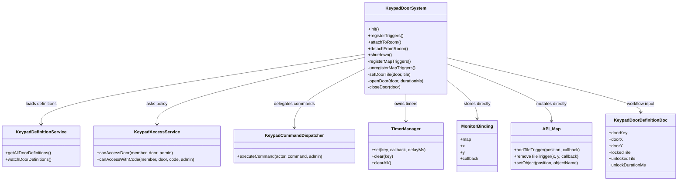
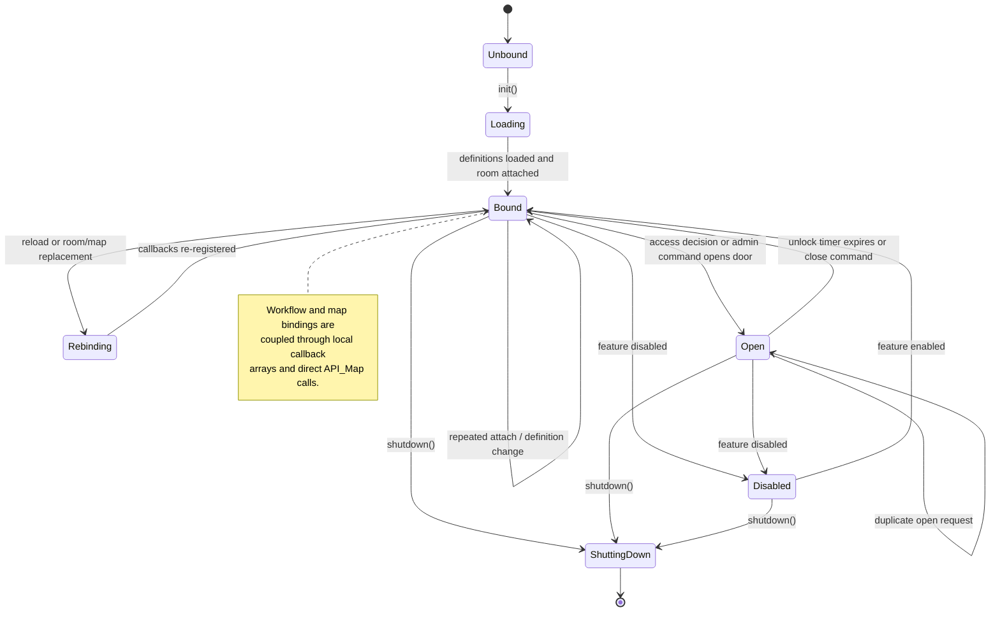
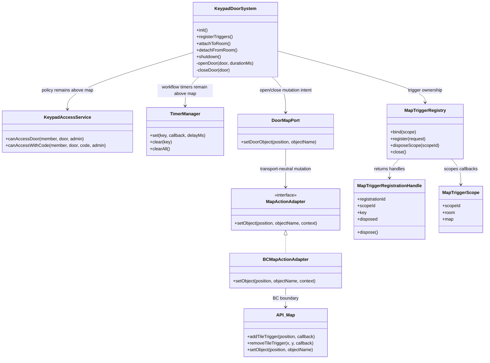
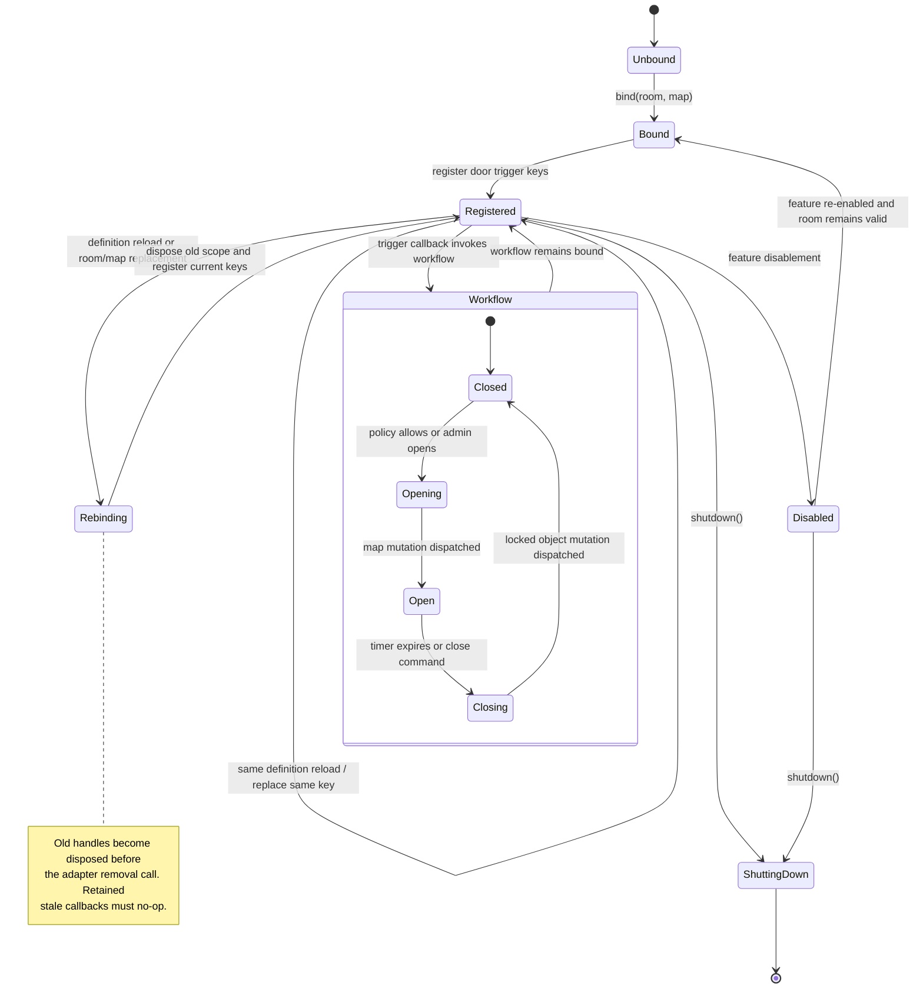

# Door Management

This document defines the Door management phase of the headless action-layer
migration. It is intentionally narrower than a rewrite of `KeypadDoorSystem`.
The existing system already separates door definitions, access checks, command
handling, and trigger registration. The migration keeps that separation and
moves only the direct BC map boundary behind reusable action-layer contracts.

## Phase boundary

The phase has two map-facing responsibilities:

- register and clean up keypad and auto-open tile triggers; and
- mutate the door object at its configured map position when the workflow opens
  or closes the door.

The following remain above the map action layer in `KeypadDoorSystem` and its
existing services:

- door definitions and enabled state;
- access policy, room-admin overrides, codes, groups, and permissions;
- command parsing and command dispatch;
- unlock duration and notification timers;
- open/closed workflow state; and
- the decision about when a door should change state.

The map adapter translates a validated request to BC and returns a structured
local-dispatch observation. It does not decide whether a character may open a
door, how long it stays open, or which tile/object asset is valid for policy.

## Actual state and required actions

The Door management phase has a complete design boundary and a focused runtime
pilot. The verified state is:

| Area                 | Actual state                                                                                                                                                                                                 | Consequence                                                                                                 |
| -------------------- | ------------------------------------------------------------------------------------------------------------------------------------------------------------------------------------------------------------ | ----------------------------------------------------------------------------------------------------------- |
| Workflow ownership   | `KeypadDoorSystem` already delegates definitions, access policy, and admin commands to their services and owns timers and open/close decisions.                                                              | Preserve these responsibilities during migration.                                                           |
| Object mutation      | `setDoorTile()` delegates to `MapObjectActionAdapter`; `BCMapObjectActionAdapter` translates to `API_Map.setObject()` and reports local dispatch only.                                                       | Keep authoritative server confirmation out of this contract until BC provides a usable confirmation event.  |
| Trigger registration | `registerMapTriggers()` uses `MapTriggerRegistry` with stable keypad and auto-open keys; local `tileTriggerBindings` storage is gone.                                                                        | Reuse this lifecycle boundary for later Door-family expansions, without claiming family-wide map migration. |
| Lifecycle            | Room replacement, reload, disablement, and shutdown dispose scoped handles; registry guards invalidate retained stale callbacks before adapter cleanup.                                                      | Preserve repeated `shutdown()`/`init()` compatibility and add production reconnect evidence later.          |
| Reuse available      | `MapTriggerRegistry` and `BCMapTriggerActionAdapter` already provide scoped handles, duplicate-key replacement, stale-callback rejection, and adapter cleanup.                                               | Reuse the qualified lifecycle boundary instead of creating Door-specific callback infrastructure.           |
| Tests                | The focused suites cover unlock/relock, admin commands, reload, access behavior, object translation/rejection/failure, duplicate registration, stale callbacks, room replacement, disablement, and shutdown. | Add controlled-room reconnect and rollback evidence before any broader rollout claim.                       |
| Production status    | The `KeypadDoorSystem` pilot is implemented and has no rollout switch; broader Door and map-family migration is not claimed.                                                                                 | Keep the migration registry at partial/pilot status until operational evidence exists.                      |

### Required action sequence

1. [x] Add transport-neutral map-object mutation types with validated position and
       object-name inputs, operation metadata, and local-dispatch semantics.
2. [x] Implement and export a BC map-object adapter that calls
       `API_Map.setObject()` without claiming server confirmation.
3. [x] Add adapter tests for translation, invalid input, and adapter failure
       behavior.
4. [x] Inject the map-object port into `KeypadDoorSystem` and route `openDoor()`
       and `closeDoor()` through it without moving access policy or timers.
5. [x] Replace local Door tile bindings with a registry bound to the current
       room/map scope and stable keypad/auto-open keys.
6. [x] Make repeated attach, definition reload, room replacement, disablement, and
       shutdown dispose active registrations and reject retained stale callbacks.
7. [x] Add duplicate-trigger and duplicate open/close mutation regression tests,
       then run the focused Door suite, strict TypeScript, formatting, and
       whitespace checks.
8. [x] Update the migration registry only after the runtime slice and lifecycle
       evidence pass; do not claim family-wide map migration.

The implementation is intentionally incremental. Each action above should be
kept independently reviewable and committed after its focused validation.

## IST: current architecture

`KeypadDoorSystem` loads definitions through `KeypadDefinitionService`, asks
`KeypadAccessService` for access decisions, delegates admin commands to
`KeypadCommandDispatcher`, and owns unlock, notification, and auto-open timers.
Those boundaries are useful and remain stable.

The current map boundary is still feature-local:

- `registerMapTriggers()` directly calls `API_Map.addTileTrigger()` and stores
  `{ map, x, y, callback }` bindings;
- `unregisterMapTriggers()` directly calls `removeTileTrigger()`;
- `setDoorTile()` directly calls `boundMap.setObject()`; and
- reload and room replacement depend on the feature's local binding array.

The risks are duplicate or stale trigger callbacks during repeated definition
reloads, direct BC coupling in the workflow, and no reusable map-object action
contract. Existing door behavior and timer policy are not the problem boundary.

### IST UML

### IST state management overview

## SOLL: layered Door management

The target architecture keeps `KeypadDoorSystem` as the workflow owner and
introduces two reusable map-facing boundaries:

1. `MapTriggerRegistry` owns scoped, idempotent trigger registrations and
   invalidates stale callbacks during reload, room replacement, disablement,
   and shutdown.
2. `MapActionAdapter` owns transport-neutral map-object mutation. The BC
   implementation translates `setObject` to `API_Map.setObject` and reports a
   structured local-dispatch result.

The door workflow calls a small `DoorMapPort` or map action service with the
validated door position and target object. It keeps its existing open/close
state and timers. The adapter never receives access policy, codes, member
permissions, or timer decisions.

### SOLL UML

### SOLL state management overview

Door management has four distinct state scopes:

| Scope        | State                                                                                | Owner                                            | Lifetime                                |
| ------------ | ------------------------------------------------------------------------------------ | ------------------------------------------------ | --------------------------------------- |
| Definition   | Door coordinates, locked/unlocked object names, keypad/auto-open tiles, enabled flag | `KeypadDefinitionService` and `KeypadDoorSystem` | Until definition reload                 |
| Registration | Room/map identity, trigger keys, handles, stale-generation status                    | `MapTriggerRegistry`                             | Current room/map instance               |
| Workflow     | Open/closed state, admin override, unlock duration, pending timers                   | `KeypadDoorSystem` and `TimerManager`            | Door workflow lifetime                  |
| Policy       | Codes, groups, permissions, whitelist, admin override decision                       | `KeypadAccessService` and command services       | Persisted access/configuration lifetime |

### Mutation and trigger contracts

The map action contract should express the operation without exposing BC types:

- `setObject(position, objectName, context)` returns a structured observation
  that records the operation ID, target position/object, and local dispatch
  time;
- invalid positions or blank object names are rejected before adapter dispatch;
- a BC adapter calls `API_Map.setObject` and treats the result as local
  dispatch, not server confirmation; and
- trigger registration uses the existing scoped registry and stable keys such
  as `keypadDoor:keypad:<doorKey>:<x>:<y>` and
  `keypadDoor:auto-open:<doorKey>:<x>:<y>`.

The action layer must not add access policy to the mutation request. A caller
that reaches `setObject` has already made the workflow decision.

## Incremental implementation plan

### Iteration 1: Design and boundary

- [x] Record current ownership and direct BC mutation risks.
- [x] Define the SOLL map-object mutation contract and door workflow boundary.
- [x] Define IST/SOLL UML and state-management diagrams.

### Iteration 2: Map-object action contract and BC adapter

- Add transport-neutral object mutation types and structured observations.
- Implement the BC adapter around `API_Map.setObject`.
- Add validation and adapter tests for position/object translation and failures.

### Iteration 3: KeypadDoorSystem trigger lifecycle

- Replace local tile binding arrays with `MapTriggerRegistry` handles.
- Preserve definition loading, access checks, command dispatch, and timers.
- Add repeated attach, definition reload, room replacement, duplicate-trigger,
  stale-callback, disablement, and shutdown tests.

### Iteration 4: Door workflow mutation integration

- Inject the map action port/adapter into `KeypadDoorSystem`.
- Route open and close mutations through the adapter.
- Preserve existing timer and manual-open behavior and prove no duplicate map
  mutation on duplicate open requests.

### Iteration 5: Qualification and expansion

- Run focused door, registry, adapter, TypeScript, formatting, and whitespace
  checks.
- Compare map trigger counts and open/close object mutations before and after
  the pilot.
- Keep Bunny park and other map systems outside this phase until each has its
  own lifecycle and rollback evidence.

## Acceptance criteria

The Door management phase is complete for the `KeypadDoorSystem` pilot when:

- [ ] `setObject` is reachable only through the map action adapter;
- [ ] door definitions, access policy, codes, permissions, command handling,
      and unlock timers remain workflow/service-owned;
- [ ] keypad and auto-open registrations use scoped idempotent handles;
- [ ] duplicate registration and definition reload do not leave duplicate
      callbacks;
- [ ] old room/map callbacks cannot execute door behavior;
- [ ] disablement and shutdown remove active callbacks;
- [ ] open and close preserve existing timer and manual override behavior;
- [ ] adapter tests cover object translation and failure behavior; and
- [ ] focused tests, strict TypeScript, formatting, and whitespace checks pass.
