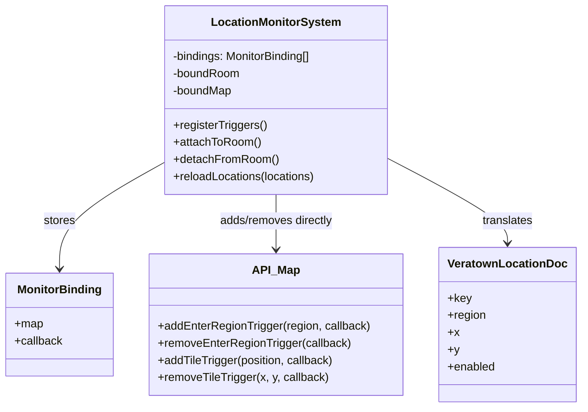
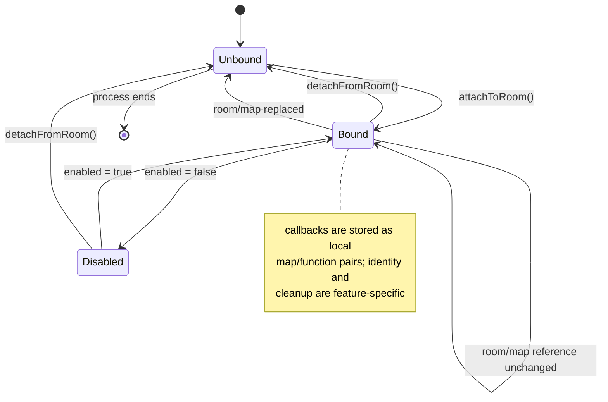
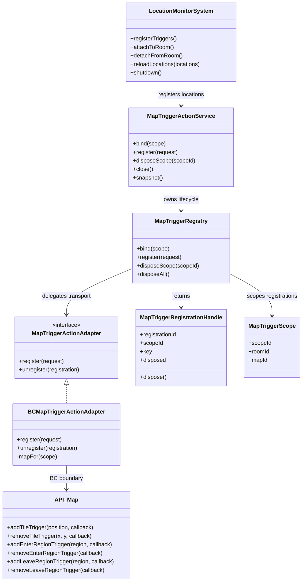
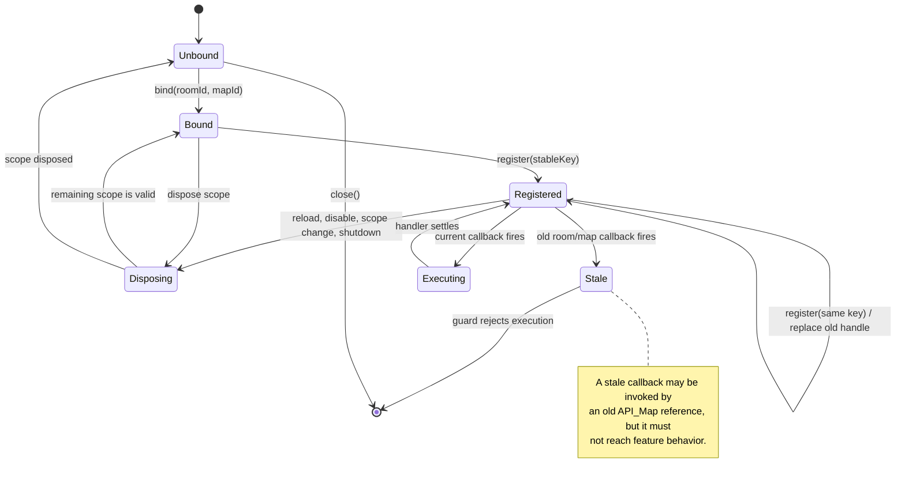

# Map Trigger Lifecycle

This document defines the map-trigger action family for the headless action
architecture. The first pilot is `LocationMonitorSystem`, whose enter-region
notifications already have room attachment, room replacement, location reload,
cooldown, and diagnostics behavior.

The lifecycle boundary is deliberately narrower than map editing. It owns
registration and cleanup of runtime tile and region callbacks. Static map
data, map replacement, character position observation, and tile mutation remain
separate contracts.

## Scope and invariants

The trigger lifecycle must guarantee:

- every registration belongs to one room and map scope;
- registration keys are idempotent within that scope;
- a replacement for an existing key disposes the previous registration first;
- a registration handle can remove exactly its own callback and is safe to
  dispose repeatedly;
- callbacks from a disposed or stale scope cannot execute feature behavior;
- room replacement disposes the old scope before binding the new one;
- reload removes registrations no longer present in configuration;
- feature disablement and shutdown dispose all active registrations;
- adapter failures are observable and do not leave an assumed live handle; and
- trigger execution remains feature-owned, while registration ownership belongs
  to the lifecycle service.

A trigger firing is not durable game state. The registry records runtime
ownership and diagnostics only. A feature may persist a consequence after its
own guarded handler decides that the event is valid.

## IST: current LocationMonitorSystem behavior

`LocationMonitorSystem` stores callback/map pairs in a local `bindings` array.
`attachToRoom()` compares the current room and map references, and
`registerMapTriggers()` removes the currently known callbacks before adding the
configured locations again. This prevents some duplicate registrations, but the
lifecycle is coupled to one feature and has no reusable registration handles.

The current behavior also leaves lifecycle policy implicit:

- cleanup is available through `detachFromRoom()`, but there is no shared
  shutdown/close contract;
- `enabled = false` stops display work but does not dispose map callbacks;
- registration identity is a callback reference rather than a stable key;
- room and map scope are represented by private fields rather than a domain
  object; and
- other tile and region features repeat their own add/remove bookkeeping.

### IST UML

### IST state management

## SOLL: scoped trigger lifecycle

The target architecture introduces a reusable `MapTriggerRegistry` behind a
workflow-facing `MapTriggerActionService` and a BC-specific adapter.

1. A feature creates a `MapTriggerScope` from the current room and map
   identity.
2. The service binds one active scope and disposes the previous scope when the
   scope changes.
3. The feature registers a stable key, trigger kind, location, and guarded
   handler. Re-registering the key replaces the previous registration.
4. The service returns a `MapTriggerRegistrationHandle`. The handle is
   idempotent and records its disposed state.
5. The adapter translates the registration into the BC map API and returns a
   transport observation. It never owns feature state or cooldowns.
6. Reload, room replacement, feature disablement, and shutdown dispose handles
   through the same registry path.

### SOLL UML

### SOLL state management overview

Map-trigger state has three scopes. None of these scopes is durable game state.

| State scope   | Example state                                                                        | Owner                                | Lifetime                                     |
| ------------- | ------------------------------------------------------------------------------------ | ------------------------------------ | -------------------------------------------- |
| Configuration | enabled locations, provider key, region or tile coordinates, stable registration key | Feature and location store           | Until the next location reload               |
| Registration  | room/map scope, active handles, adapter registration IDs, disposed state             | MapTriggerActionService and registry | Current room/map instance                    |
| Execution     | callback guard, cooldown, active display, handler outcome, diagnostics               | Feature system                       | One trigger event or bounded cooldown window |

### Lifecycle operations

| Operation         | Registry behavior                                                          | Feature behavior                                                     |
| ----------------- | -------------------------------------------------------------------------- | -------------------------------------------------------------------- |
| Initial attach    | Bind current room/map scope and register desired keys                      | Load current configuration and expose readiness                      |
| Idempotent attach | Reuse the same scope; replace only changed keys                            | Avoid duplicate callbacks on repeated startup signals                |
| Location reload   | Remove keys absent from the new configuration; replace changed definitions | Preserve provider and cooldown ownership                             |
| Room replacement  | Dispose the old scope, bind the new room/map, register current keys        | Keep configuration and diagnostics, reset runtime registration state |
| Disable           | Dispose feature-owned handles or scope                                     | Reject future execution and clear active runtime work                |
| Shutdown          | Close registry and dispose every handle                                    | Stop accepting trigger work and release feature resources            |

## Map action boundary

The map trigger action is intentionally separate from other map operations:

- `observeTile` and `setTile` concern map state;
- `registerTrigger` and `unregisterTrigger` concern runtime callback
  ownership;
- `observePosition` concerns character location; and
- full map replacement remains a privileged configuration operation.

The adapter must support the BC trigger shapes used by the pilot:

- tile callbacks removed with their original coordinates and callback;
- enter-region callbacks removed by callback identity; and
- leave-region callbacks removed by callback identity.

The service owns validation, stable keys, scope transitions, idempotency,
handle disposal, and diagnostics. The adapter owns only API translation and
transport-level registration results.

## Incremental implementation plan

### Iteration 1: Design and boundary

- [x] Document IST/SOLL ownership, UML diagrams, and state management.
- [x] Define scope, stable-key, handle, cleanup, and stale-callback invariants.
- [x] Select `LocationMonitorSystem` as the first pilot.

### Iteration 2: Domain contracts and registry

- Define transport-neutral trigger request, scope, registration, and handle
  contracts.
- Implement idempotent scoped registration and disposal.
- Add tests for duplicate keys, replacement, stale scopes, and close behavior.

### Iteration 3: BC adapter

- Translate tile, enter-region, and leave-region registration to `API_Map`.
- Return structured registration observations and retryable transport failures.
- Add adapter tests for exact callback identity and coordinate cleanup.

### Iteration 4: LocationMonitorSystem pilot

- Replace local `bindings` with the registry service.
- Preserve cooldown, provider, communication, and diagnostics behavior.
- Dispose registrations on attach, reload, disablement, room replacement, and
  shutdown.
- Add room replacement and repeated attach integration tests.

### Iteration 5: Qualification and expansion

- Run focused map-trigger, location-monitor, TypeScript, formatting, and import
  boundary checks.
- Compare trigger counts and callback behavior before and after the pilot.
- Migrate additional tile/region features one at a time.

## Acceptance criteria

The first map-trigger action slice is complete when:

- registration is scoped to room/map identity;
- stable keys are idempotent and replacement disposes the old callback;
- every registration returns an idempotent cleanup handle;
- old room/map callbacks cannot execute feature behavior;
- reload removes stale configuration registrations;
- disablement and shutdown clean up callbacks;
- tile, enter-region, and leave-region adapters have contract coverage;
- `LocationMonitorSystem` retains cooldown and provider behavior; and
- focused tests, strict TypeScript, formatting, and import-boundary checks pass.
