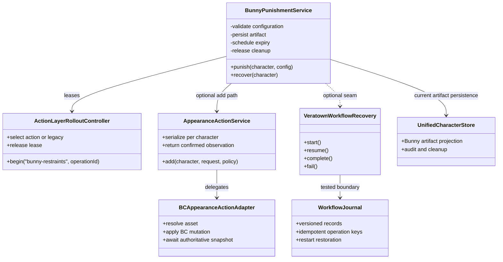
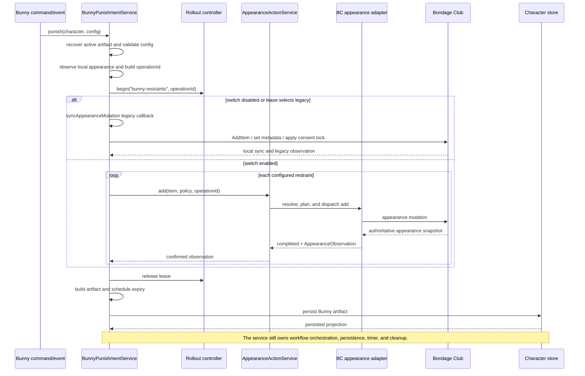
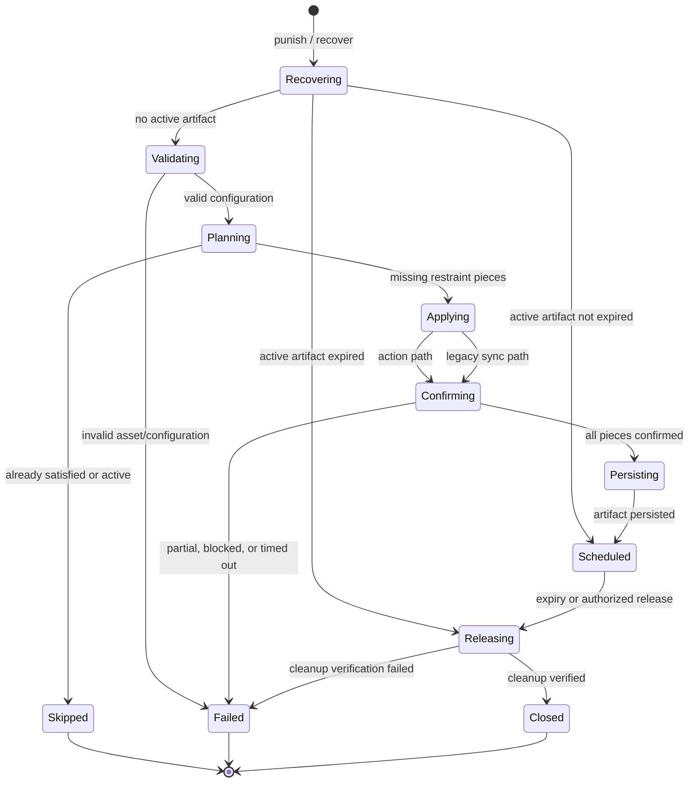
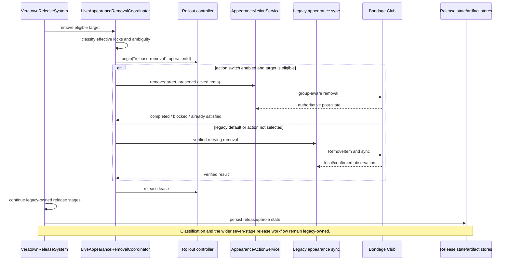
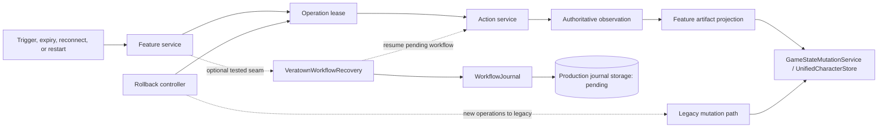

# Action-Layer Migrated Features

This is the maintained feature registry for the action-layer migration. It
answers a narrower question than the architecture proposal: which production
feature behavior is actually routed through the new action layer today, which
implementation still owns the surrounding workflow, and what evidence is
missing before ownership can move.

The registry is intentionally conservative. A feature is not considered
migrated merely because an adapter, feature flag, or test harness exists. A
feature is migrated only when its runtime path, durable ownership, recovery
behavior, and rollback evidence are all documented and enabled deliberately.

For the architecture, layer responsibilities, and overall migration plan, see
[ACTION_LAYER_OVERVIEW.md](ACTION_LAYER_OVERVIEW.md).

## Status Legend

| Status                 | Meaning                                                                                                                                               |
| ---------------------- | ----------------------------------------------------------------------------------------------------------------------------------------------------- |
| Partial / opt-in slice | A bounded runtime operation can use the action layer, but the feature workflow and/or default runtime still uses legacy ownership.                    |
| Tested seam            | Contracts and tests exist, but the seam is not necessarily injected or enabled in production.                                                         |
| Not migrated           | The feature remains legacy-owned; no action-layer runtime slice is claimed.                                                                           |
| Production migrated    | The runtime path, durable state, recovery, rollback, and operational evidence have passed the documented gates. No feature currently has this status. |

## Feature Registry

| Feature                                                          | Current status                        | Action-layer runtime slice                                                                                                                              | Default switch                                 | Still legacy-owned                                                                                                                                                                    | Evidence and next gate                                                                                                                                                                                  |
| ---------------------------------------------------------------- | ------------------------------------- | ------------------------------------------------------------------------------------------------------------------------------------------------------- | ---------------------------------------------- | ------------------------------------------------------------------------------------------------------------------------------------------------------------------------------------- | ------------------------------------------------------------------------------------------------------------------------------------------------------------------------------------------------------- |
| Bunny punishment                                                 | **Partial / opt-in slice**            | Per-piece restraint addition through `AppearanceActionService`; action results must be confirmed before the service projects the applied pieces.        | `action_layer_bunny_restraints_enabled: false` | Configuration selection and validation, active-artifact checks, punishment counting, artifact persistence, expiry timers, release cleanup, and the surrounding service orchestration. | Local staging, adapter contracts, and short qualification pass. Run controlled-room confirmation/reconnect and production-storage rehearsal; then extract the full workflow before enabling by default. |
| Release appearance removal                                       | **Partial / selected target removal** | Eligible selected targets can be removed through the action appearance coordinator with authoritative confirmation and fail-closed lock classification. | `action_layer_release_removal_enabled: false`  | Release confirmation, teleport, cage/kennel release, nudity verification, keypad access, parole monitoring, release persistence, and remaining cleanup orchestration.                 | Local lock/ambiguity matrix and rollback tests pass. Real-room confirmation and durable restart/reconnect evidence remain open.                                                                         |
| Bunny WoodenSign behavior                                        | **Removed**                           | None.                                                                                                                                                   | N/A                                            | No Bunny sign application, artifact, verification, or cleanup path remains.                                                                                                           | Removal is complete; other features may still use `WoodenSign` independently.                                                                                                                           |
| Communication, movement, map, inventory, and permission families | **Not migrated**                      | No production action-layer ownership is claimed.                                                                                                        | N/A                                            | Existing feature systems and BC helpers.                                                                                                                                              | Define contracts, adapters, contract tests, and rollback ownership one family at a time.                                                                                                                |

## What “Bunny Migrated” Means

**No: Bunny is not fully migrated to the new method.** The current migration is a
narrow restraint-application slice, available only when the Bunny rollout flag
is enabled. The normal runtime default remains the legacy path.

The action path currently owns the bounded external operation of adding each
configured restraint and receiving the adapter's confirmed appearance
observation. `BunnyPunishmentService` still owns the business workflow around
that operation. In particular, it still performs the pre-checks, selects and
validates configurations, decides whether punishment is already active,
constructs the punishment artifact, persists the successful result, schedules
expiry, and performs release cleanup through the legacy mutation flow.

The production `Veratown` wiring currently injects the action appearance service
and rollout controller into `BunnyPunishmentService`. The optional
`VeratownWorkflowRecovery` interface is implemented and tested, but it is not
currently injected by that runtime constructor. The workflow journal is
therefore a tested recovery boundary, not evidence that Bunny production
restarts currently recover through that journal.

Full Bunny migration requires all of the following:

- extract the Bunny business workflow from `BunnyPunishmentService` around
  explicit activities and versioned state;
- provide production-backed durable journal storage and inject the recovery
  boundary at runtime;
- rehearse authoritative confirmation across room reconnect and process
  restart;
- move artifact persistence, expiry recovery, and cleanup ownership behind the
  workflow boundary;
- retain an operation-keyed rollback path until the new workflow proves
  equivalent behavior in a controlled room and under the performance gates.

## Current Ownership Model

The dashed recovery relationship is deliberate: the interface exists at the
feature boundary, but current production construction does not provide the
optional instance. This diagram should be updated whenever runtime injection
or durable ownership changes.

## Bunny Restraint Slice

The action branch does not fall back to the legacy mutator for the same
operation. A failed action operation is returned as partial or failed; the
rollout lease is released, and the caller must use the documented recovery or
retry behavior rather than silently invoking both implementations.

### Bunny workflow state today

This is a target-oriented view of the service's current states, not a claim
that every state is already represented by a durable production state machine.
Only the journal model and recovery tests provide explicit versioned workflow
state; current Bunny runtime orchestration remains in the service.

## Release Removal Slice

The release action slice is selected-target removal only. It does not migrate
teleportation, cage or kennel release, forced nudity, keypad access, parole
monitoring, or release persistence.

## Recovery and Persistence Boundary

Current facts represented by this diagram:

- the feature service remains the runtime owner of Bunny artifact projection;
- the action service returns an observed result but does not write feature state;
- `WorkflowJournal` has in-memory and contract-test coverage;
- production journal storage and runtime recovery injection are pending;
- rollback selects one owner for a new operation and does not mix action and
  legacy mutation for that operation.

## Evidence Ledger

| Evidence                                 | Current result                            | What it proves                                                                                                          | What it does not prove                                        |
| ---------------------------------------- | ----------------------------------------- | ----------------------------------------------------------------------------------------------------------------------- | ------------------------------------------------------------- |
| Action-layer and adapter tests           | Passing                                   | Pure contracts, BC translation, confirmation lifecycle, lock protection, and failure classification behave as tested.   | Real-room packet behavior or production restart recovery.     |
| Bunny/release staging harnesses          | Passing for local deterministic scenarios | Requested, local, confirmed, persisted projections and rollout ownership agree in the harness.                          | Live connector timing, room reconnect, or production storage. |
| Workflow journal tests                   | Passing                                   | Optimistic versions, idempotent keys, terminal-state protection, and restart restoration work against the test storage. | Runtime injection or a durable production backend.            |
| TypeScript and formatting checks         | Passing                                   | Current source and documentation edits meet static checks.                                                              | Operational readiness.                                        |
| 19/25-character short qualification runs | Passing                                   | The short deterministic workload stays within configured thresholds.                                                    | The required 30-minute production qualification.              |

## Maintenance Rules

Update this document in the same change whenever any of the following changes:

1. A feature gains or loses an action-layer call site.
2. A rollout switch, DI registration, lease namespace, or rollback rule changes.
3. A workflow journal, durable store, recovery injection, or artifact owner
   changes.
4. A legacy BC mutation is removed, added, or becomes unreachable for a
   migrated operation.
5. A qualification test changes the evidence or an open gate is closed.

For every new migrated slice, add one registry row, one ownership description,
one current-flow UML diagram or diagram update, one evidence-ledger entry, and
an explicit list of remaining legacy responsibilities. Keep “tested” separate
from “runtime enabled” and keep “runtime enabled” separate from “production
migrated.”
