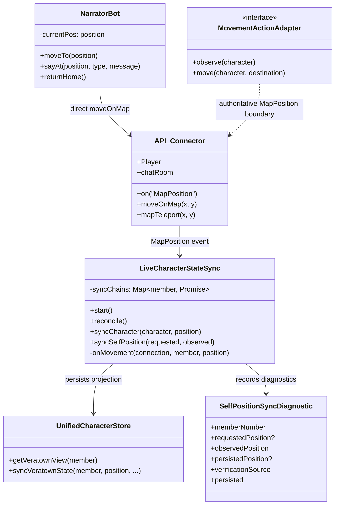
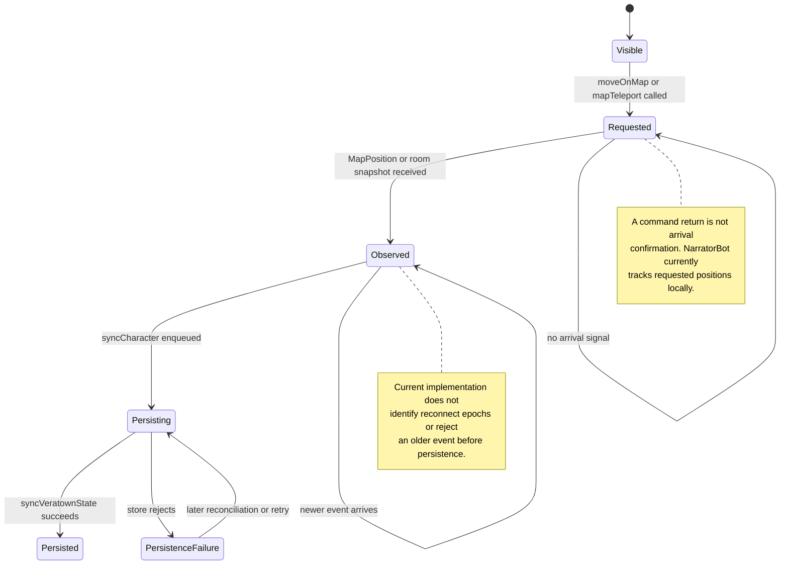
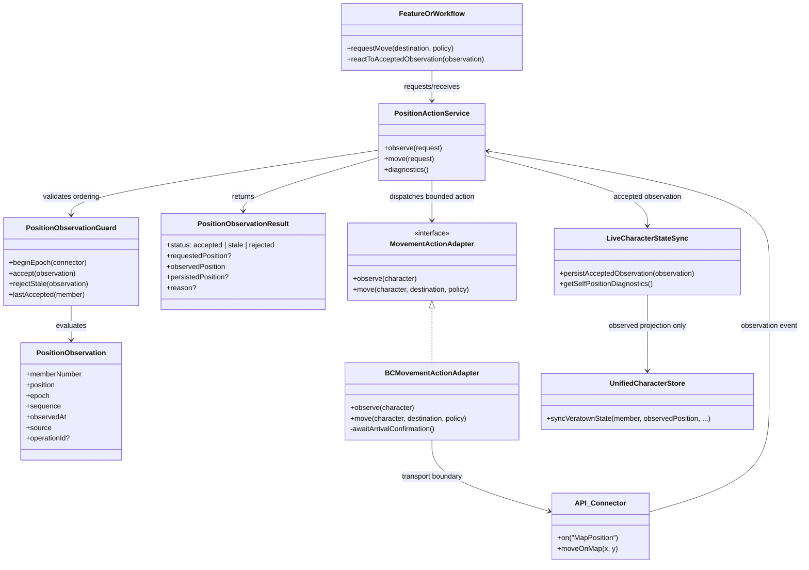
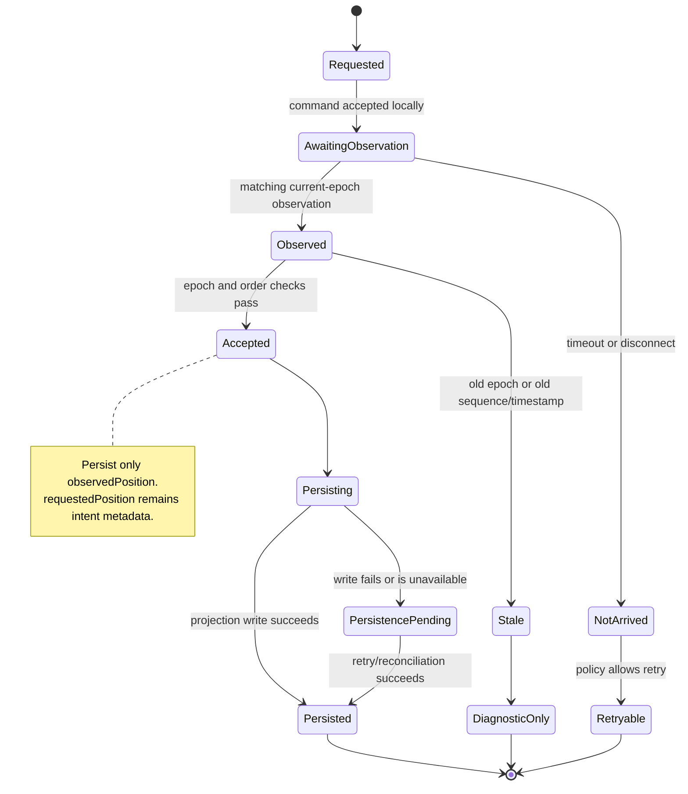
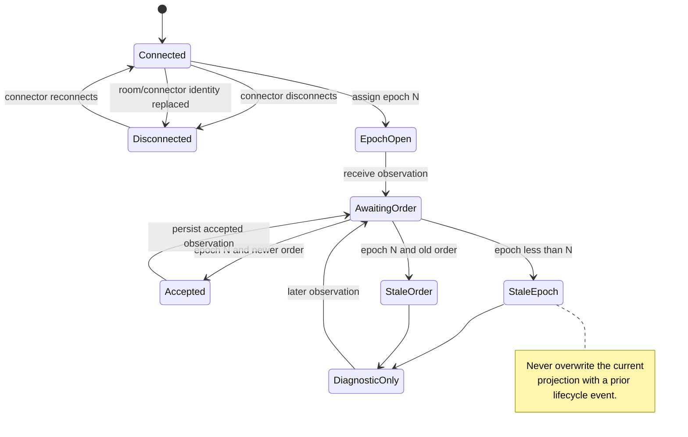

# Position Observation and Movement

This document defines the position action family for the headless action
architecture. The first slice is **observation**, not teleportation. A movement
request and an observed arrival are different facts and must remain different
in the domain, diagnostics, persistence, and workflow state.

The immediate owner is `LiveCharacterStateSync` for projection and
`MovementActionService` for bounded movement commands. It receives live map
position events and room snapshots, applies reconnect-epoch and sequence
guards, and reconciles accepted observations into the Veratown character
projection. `BCMovementActionAdapter` dispatches `moveOnMap()` and completes
only on a matching `MapPosition` observation. The release workflow and the
bounded `NarratorBot` caller use that path; broader movement callers remain
legacy-owned.

## Scope and invariants

The position design has these invariants:

- `requestedPosition` describes an intent or command argument only.
- `observedPosition` describes a position received from the connector or a
  live room snapshot.
- `persistedPosition` describes the last accepted database projection.
- A requested destination is never persisted merely because a command returned.
- An observation from an older reconnect epoch is stale, even if its timestamp
  is newer than an observation from the current epoch.
- Within one epoch, an older observation sequence cannot overwrite a newer one.
- Rejected observations remain diagnosable but cannot trigger persistence or
  position-dependent business transitions.
- Teleportation remains deferred until an authoritative arrival confirmation
  contract exists.

## IST: pre-observation-slice ownership and behavior

### Current flow

`LiveCharacterStateSync.start()` subscribes each configured connector to
`MapPosition`. The event handler finds the character in the current room and
calls `observeCharacter(character, position)`. That path enters
`syncCharacter`, serializes persistence per member, reads the current
Veratown view, and calls `UnifiedCharacterStore.syncVeratownState`.

Periodic `reconcile()` takes `MapPos` from the connector's visible room
characters and the connector's own `Player` object. `syncSelfPosition` also
records a `SelfPositionSyncDiagnostic` containing requested, observed, and
persisted positions plus a verification source.

The current flow has no connector epoch, observation sequence, or stale-event
rejection. The per-member `syncChains` map preserves arrival order of async
persistence work, but it does not establish that the event being persisted is
newer than the last accepted observation.

The pre-slice behavior had a boundary defect: when `syncSelfPosition` received
a requested position, it could persist the requested position rather than the
observed position. The observation slice now routes observed coordinates to
the persistence boundary and records the distinction in diagnostics.

## Actual implementation state

`LiveCharacterStateSync` now owns the observation guard. It tracks a connection
epoch per connector, assigns or accepts observation sequences, rejects prior
epochs and non-newer same-epoch observations, persists only accepted observed
coordinates, and records accepted/stale diagnostics. `Connected` and
`Disconnected` events advance the epoch. This is a Veratown synchronization
slice plus a production `MovementActionAdapter` implementation. The BC
adapter correlates the member number and acceptance predicate against
`MapPosition`, and fails on timeout, disconnect, cancellation, or dispatch
error. It never treats `moveOnMap()` returning as arrival and does not write
the durable position projection. Position-only
observations persist coordinates and derive restraint state from the existing
profile appearance; they do not overwrite an existing appearance projection
from the local BC cache. A character with no stored appearance still receives
the initial cache bootstrap, while fresh appearance-sync callbacks continue to
persist authoritative appearance observations.

### IST UML

### IST state management

### IST risks

| Concern              | Current owner                    | Current behavior                                           | Risk                                                              |
| -------------------- | -------------------------------- | ---------------------------------------------------------- | ----------------------------------------------------------------- |
| Move request         | `MovementActionService`          | Bounded callers dispatch through `BCMovementActionAdapter` | Legacy direct callers remain outside the migration                |
| Local position       | Caller or `API_Character.MapPos` | May be a local/tracked value                               | Request can be confused with observation                          |
| Observation          | `LiveCharacterStateSync`         | `MapPosition`, room snapshot, or `Player.MapPos`           | No epoch or monotonic stale guard                                 |
| Ordering             | `syncChains` per member          | Serializes persistence promises                            | Does not reject stale event content                               |
| Persistence          | `UnifiedCharacterStore`          | Writes `lastPosition` and `lastPositionAt`                 | Older observations can overwrite newer state                      |
| Arrival confirmation | `BCMovementActionAdapter`        | Matching member `MapPosition`, exact or accepted region    | Controlled-room reconnect and server-denial evidence remain open  |
| Diagnostics          | `SelfPositionSyncDiagnostic`     | Keeps requested/observed/persisted fields                  | Current persistence argument can be requested instead of observed |

## SOLL: observation-first layered architecture

The first implementation slice introduces a position observation boundary around
`LiveCharacterStateSync` without enabling movement migration. The boundary
normalizes every incoming observation with:

- member number and position;
- connector identity and reconnect epoch;
- per-epoch observation sequence, when supplied by the event source;
- observed timestamp and source;
- optional operation ID linking it to a movement request;
- acceptance or stale-rejection reason.

The observation service owns epoch and ordering checks. It may delegate accepted
observations to `LiveCharacterStateSync` for appearance and profile projection,
but it must pass the observed position, never the requested destination, to the
persistence boundary. Workflows remain responsible for deciding what a
position means for gameplay.

### SOLL layered UML

### SOLL state-management overview

| State scope          | Example                                                           | Owner                                                | Durable?                                                                 |
| -------------------- | ----------------------------------------------------------------- | ---------------------------------------------------- | ------------------------------------------------------------------------ |
| Request              | destination, operation ID, movement policy                        | Feature/workflow and action context                  | Only if a workflow needs recovery                                        |
| Connector lifecycle  | connector identity, reconnect epoch, connected/disconnected state | Position observation service                         | Usually process-local; durable workflow may record epoch at attempt time |
| Observation          | position, epoch, sequence, timestamp, source, operation ID        | Position observation service                         | Diagnostic record or event as required                                   |
| Projection           | accepted observed position and `lastPositionAt`                   | `LiveCharacterStateSync` and `UnifiedCharacterStore` | Yes                                                                      |
| Workflow consequence | arrived, not arrived, timed out, retryable, blocked               | Workflow                                             | Yes when business state depends on it                                    |

The requested, observed, and persisted values are deliberately visible in the
result and diagnostics:

### Reconnect epochs and stale-position rejection

An epoch is incremented whenever a connector disconnects, is replaced, or
rejoins a room in a way that invalidates events from the previous lifecycle.
Each incoming observation is stamped with the epoch active when it was
received. The guard accepts an observation only when:

1. its epoch equals the current connector epoch;
2. its sequence is newer than the last accepted sequence in that epoch, when a
   sequence is available; and
3. its observed timestamp is not older than the last accepted observation when
   the source cannot provide a sequence.

Epoch comparison has priority over timestamp comparison. A delayed event from
a previous connection is stale even if its wall-clock timestamp is later due
to clock skew or delayed delivery.

## Movement and teleport boundary

Movement command dispatch is owned by `MovementActionService` and translated by
`BCMovementActionAdapter`. The adapter may send `moveOnMap()`, but it returns
`completed` only after a matching member `MapPosition` observation satisfies
the exact destination or the caller's acceptance predicate. It does not update
the durable position projection; `LiveCharacterStateSync` remains the
observation and persistence owner.

Teleportation is explicitly deferred. Before `teleportCharacter` can be
implemented or migrated, the contract must define:

- which connector event proves arrival at the requested destination;
- how the event is correlated to the teleport operation;
- what happens when the server clamps, denies, or reroutes the destination;
- how disconnect and reconnect invalidate pending arrival confirmation;
- how a workflow distinguishes `queued`, `observed`, `timed_out`, and
  `unknown` outcomes; and
- how an already-at-destination observation is treated idempotently.

The movement contract now covers exact and region acceptance, already-at-target
idempotency, unrelated-member events, timeout, disconnect, cancellation,
dispatch failure, listener cleanup, and operation metadata in local tests.
Legacy movement helpers remain compatibility code until controlled-room
reconnect and room-replacement evidence is retained.

## Incremental implementation plan

### Iteration 1: Observation contract and diagnostics

- [x] Add a transport-neutral position observation type with epoch, order,
      source, and observed timestamp.
- [x] Add a guard that rejects prior-epoch and out-of-order observations.
- [x] Route accepted observations to `LiveCharacterStateSync` using observed
      coordinates.
- [x] Extend self-position diagnostics with epoch, ordering, and stale status.

### Iteration 2: Focused verification

- [x] Test a requested destination that differs from the observed position.
- [x] Test a newer observation followed by an older observation in the same
      epoch.
- [x] Test an observation from a prior reconnect epoch arriving after
      reconnect.
- [x] Test that rejected observations do not call persistence.
- [x] Test that accepted observations remain serialized per character.
- [x] Test reconnect invalidation and diagnostic visibility.

### Iteration 3: Movement adapter qualification

- [x] Define the arrival event and operation-correlation contract.
- [x] Implement and test `observePosition` and authoritative movement with connector doubles.
- [ ] Qualify observation epochs and delayed events in a controlled room.
- [x] Add bounded movement callers only after dispatch-versus-arrival behavior
      is proven (`ReleaseWorkflowSystem`, `NarratorBot`).
- [ ] Add an explicit movement rollout switch before migrating additional
      callers.

### Iteration 4: Teleport decision

- Revisit teleport only after arrival confirmation, timeout, reconnect, and
  server rejection semantics have executable tests and live evidence.
- Migrate one low-risk caller with rollback ownership and no direct persistence
  of requested coordinates.

### Next-phase gate

The observation slice is covered by
`bin/games/veratown/__tests__/liveCharacterStateSync.test.ts` and the unified
action-layer cycle. Movement cannot progress until controlled reconnect and
room-recreation evidence exists, followed by tests for arrival correlation,
server denial or clamping, timeout, cancellation, stale epochs, and
already-at-destination idempotency.

## Acceptance criteria

Position observation has its first runtime slice when:

- requested, observed, and persisted positions are distinct in types and tests;
- observations carry a connector reconnect epoch and deterministic ordering;
- stale prior-epoch observations are rejected;
- stale same-epoch observations are rejected;
- rejected observations cannot overwrite the persisted projection;
- accepted observations persist only their observed coordinates;
- diagnostics expose accepted and rejected outcomes;
- per-character serialization remains intact;
- reconnect invalidation is covered by focused tests; and
- no movement or teleport caller is enabled by default before arrival semantics
  are qualified.
