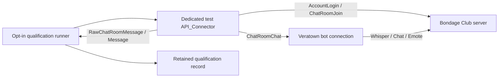

# Real-Room Test Bot Proposal

## Decision summary

Add a standalone, opt-in qualification harness that uses a dedicated Bondage
Club test account and the existing `API_Connector` Socket.IO implementation to
join an explicitly named test room, send safe commands, observe responses, and
record connector behavior.

Use Playwright only as an optional UI-observation layer. The bot connector is
the more direct and deterministic end-to-end path for testing authentication,
room join, command ingress, message delivery, reconnect, and action-layer
fallback behavior.

## Why this is feasible

The current connector already owns the required protocol path:

- `API_Connector` logs in through `AccountLogin` and exposes connection
  lifecycle events.
- `ChatRoomJoin(name)` joins an existing room and waits for room synchronization.
- `SendMessage(type, text, target)` emits the real `ChatRoomChat` protocol
  message.
- `RawChatRoomMessage` and `Message` expose server-observed room messages.
- `CommandParser` consumes `!command` whispers or chat messages from the room.

The Bondage Club browser client uses the same server message names. This makes
the harness a real protocol test, not a mocked connector test.

## Scope

The first implementation should cover:

1. Login with a dedicated test account.
2. Join an existing room without creating or modifying rooms.
3. Send one safe whispered command to the production-shaped bot connection.
4. Observe and assert the bot response on the test connection.
5. Exercise Chat, Whisper, and Emote transport paths where the room policy
   permits them.
6. Capture disconnect and reconnect observations.
7. Run one migrated notification caller with the communication rollout enabled.
8. Run the same caller with rollout disabled and verify legacy fallback.
9. Write a small retained qualification record without persisting credentials.

The first version must not run restraint, appearance, movement, inventory,
permission, room-admin, or other destructive gameplay commands.

## Non-goals

- Creating or configuring a live room automatically.
- Registering accounts or handling account verification.
- Replacing unit and simulated connector tests.
- Claiming `queued` means delivered. The existing contract remains that a
  successful synchronous `SendMessage` proves only local connector acceptance.
- Migrating replies or workflow-critical notifications before their contracts
  are defined.

## Proposed shape

The runner should instantiate `API_Connector` directly rather than extend the
normal production `createBotConnections` pool. This prevents the test account
from silently becoming a production Veratown role and keeps test lifecycle and
cleanup explicit.

Phase 0 is implemented in
`scripts/qualification/real-room-test-bot.ts`, with focused tests in
`scripts/qualification/real-room-test-bot.test.ts`. The runner uses the
connector's no-room-creation-on-reconnect option, so a reconnect cannot turn a
mistyped room name into a newly created room.

The runner must call `ChatRoomJoin` only. It must never use
`joinOrCreateRoom`, because a wrong room name must fail rather than create a
room.

## Local configuration contract

Use environment variables or a local, ignored qualification file. Never put
these values in tracked configuration, test snapshots, logs, or chat messages.

| Variable                       | Purpose                                                          |
| ------------------------------ | ---------------------------------------------------------------- |
| `BC_REAL_ROOM_TEST_ENABLED`    | Explicit opt-in switch; must equal `true`.                       |
| `BC_TEST_SERVER_URL`           | Socket.IO server endpoint.                                       |
| `BC_TEST_ENV`                  | Connector environment, normally `live` only for an approved run. |
| `BC_TEST_USERNAME`             | Dedicated test account name.                                     |
| `BC_TEST_PASSWORD`             | Dedicated test account password.                                 |
| `BC_TEST_ROOM`                 | Exact existing room name.                                        |
| `BC_TEST_TARGET_MEMBER_NUMBER` | Expected bot member number for command targeting.                |
| `BC_TEST_TIMEOUT_MS`           | Bounded wait for join, response, and reconnect assertions.       |
| `BC_TEST_DRY_RUN`              | Validate enabled configuration without opening a connector.      |

The harness should reject startup unless the opt-in switch, server URL, room,
account, and target member number are all present. It should redact usernames,
room details, and credentials from error output where practical.

## Safety rules

- Use a dedicated test account and a private test room.
- Grant the test account only the permissions needed for the selected commands.
- Maintain an explicit safe-command allowlist; deny all unknown commands.
- Do not call room creation, room update, admin promotion, appearance, item,
  movement, restraint, inventory, or permission APIs from the runner.
- Abort if the joined room does not match the configured room identity.
- Keep the communication rollout disabled unless a test explicitly enables it.
- Disconnect in a `finally` block and leave no timers or sockets running.
- Keep live-room runs manual/opt-in in CI and local development.
- Store evidence as metadata and observations, never credentials or session data.

## Qualification phases

### Phase 0: Harness contract

Add the runner entry point, environment validation, safe-command allowlist,
bounded timeouts, cleanup, redaction, and a dry-run mode that verifies local
configuration without connecting.

Expected executable checks:

- missing configuration fails closed;
- disabled opt-in does not connect;
- safe commands are accepted;
- destructive or unknown commands are rejected;
- timeout and disconnect cleanup closes the connector.

### Phase 1: Protocol smoke test

Against an approved test room, verify login, `ChatRoomJoin`, room sync, a
whispered read-only command, response observation, and clean disconnect. Retain
the room label, connector observations, operation key, and timestamps.

### Phase 2: Communication qualification

Run a controlled matrix for Whisper, Chat, and Emote. Verify:

- normal return is reported as `queued`, not `sent`;
- connector failure is reported as `unknown`;
- reconnect resumes operation without duplicate operation-key dispatch;
- rollout enabled uses the communication action path;
- rollout disabled uses the legacy path;
- one caller rollback preserves a single owner for a new operation.

Visible room output is supporting evidence only. It does not create an
authoritative delivery receipt.

### Phase 3: Optional Playwright observation

Use VS Code Playwright tooling or a separately configured browser runner only
to assert what a human browser sees: room entry, visible messages, and absence
of unexpected UI errors. Reuse an already-authenticated local browser profile;
do not transfer credentials or cookies through the assistant.

Playwright observations must be correlated with the connector operation key and
server-side message observation. They do not replace connector assertions.

## Evidence and promotion gate

A real-room qualification record is acceptable only when it contains:

- test run identifier and UTC timestamps;
- connector environment label and room label;
- test account role, without password or token;
- operation keys and requested channels;
- observed `queued` or `unknown` results;
- received response/message observations;
- reconnect and cleanup results;
- rollout state and legacy/action path;
- known limitations and rollback outcome.

The communication rollout remains disabled until a controlled record covers at
least one migrated caller, one legacy fallback, one reconnect, one connector
failure, and one rollback decision. The record must explicitly state that no
authoritative delivery receipt exists.

## Implementation sequence

1. [x] Add a standalone `scripts/qualification/real-room-test-bot.ts` runner.
2. [x] Add focused local tests for configuration, safety, timeout, and cleanup.
3. [x] Add `qualification:real-room` and
       `test:qualification:real-room` package scripts; both require the explicit
       opt-in switch for live connection.
4. Run Phase 1 in a dedicated room with a dedicated account.
5. Run Phase 2 against the communication slices, starting with WindowSystem or
   another low-risk notification caller.
6. Add Playwright only if visual room evidence is needed after protocol evidence
   is green.
7. Record the go/no-go result before enabling any rollout outside the test room.

## Risks and mitigations

| Risk                                             | Mitigation                                                                     |
| ------------------------------------------------ | ------------------------------------------------------------------------------ |
| Wrong room name creates or affects a room        | Use `ChatRoomJoin` only and verify room identity.                              |
| Test command mutates live game state             | Safe-command allowlist and dedicated room/account.                             |
| Credentials leak through logs or evidence        | Environment-only secrets, redaction, and ignored local files.                  |
| A visible message is mistaken for delivery proof | Keep `queued` distinct from `sent`; require an authoritative receipt contract. |
| Reconnect duplicates a notification              | Stable operation keys, bounded deduplication, and retained observations.       |
| Live qualification destabilizes production       | Manual opt-in, private test room, bounded timeouts, and immediate cleanup.     |

## Recommendation

Implement the protocol-level test bot first. It is lower complexity and gives
stronger evidence about the behavior Ropeybot controls. Add Playwright as a
thin observation layer only after the connector harness can run safely and
repeatably.
